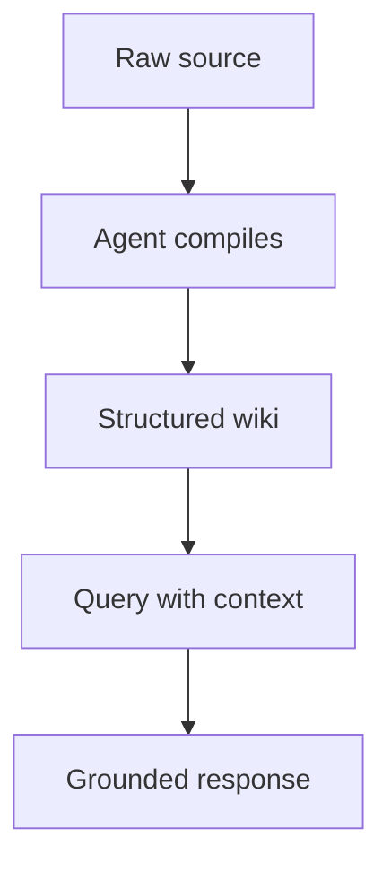

# SKILL: brain-OxIA — Obsidian x AI Knowledge Brains

## Commands

| Command | What it does |
|---|---|
| `/brain-new` | Build a complete Obsidian brain system from scratch |
| `/brain-project` | Turn an existing system, project, or documentation into an Obsidian brain |
| `/brain-update` | Add new material to an existing brain without rebuilding it |
| `/brain-migrate` | Move disorganized notes or an unstructured vault into the brain architecture |
| `/brain-connect` | Guide the user through connecting an existing vault to Claude |
| `/brain-status` | Quick health check — hot cache, structural issues, recommended next actions |
| `/brain-audit` | Deep structural and knowledge audit — full report with severity tags and gap analysis |
| `/brain` | Auto-detects which command is needed, or asks if unclear |

**`/brain` detection logic:**
- User brings existing material AND no vault yet → `/brain-project`
- User describes a new topic to build from zero → `/brain-new`
- User has a vault but no brain-OxIA structure yet → `/brain-migrate`
- User mentions a vault already exists and wants to add something → `/brain-update`
- User has a vault but can't connect it to Claude → `/brain-connect`
- User wants a quick checkup → `/brain-status`
- User wants a thorough diagnosis with full report → `/brain-audit`
- If still unclear: ask **"Do you have an existing vault, existing material to convert, or are you starting completely from scratch?"**

---

## SHARED SECTION — Applies to both modes

### Global constraints (never violate)
- Obsidian CLI is free since v1.12.4 — never recommend the Catalyst License for CLI access
- Never invent information, structures, or behaviors not supported by the research at the end of this skill
- Never assume user data without asking first
- Never advance to the next step without explicit user confirmation
- Never generate all files at once — one at a time, with approval after each
- One question per turn — wait for the answer before continuing
- If information is insufficient or ambiguous: stop and ask, never assume

### Sync setup (ask during onboarding, not mandatory)
Sync is optional. The vault works fully on a single device without any sync service. If the user wants multi-device access, accept any of these options and adapt the setup instructions accordingly:
- **Google Drive** — free, install Google Drive for Desktop, vault lives inside the local Drive folder
- **iCloud Drive** — built into macOS/iOS, place vault in iCloud Drive folder
- **Dropbox / OneDrive / Syncthing** — any service that syncs a local folder works the same way
- **Obsidian Sync** — official paid option (~$10/month), fully supported
- **No sync** — single device, no setup needed

When generating CLAUDE.md and setup instructions: include the vault path and sync instructions only for the option the user has chosen. If no sync is used, omit sync instructions entirely. Never mention Google Drive specifically unless the user has chosen it.

### Sync-related folder constraints (apply only when sync is in use)
- No special characters in folder or file names
- Short paths (avoid deep nesting)
- No dependency on Obsidian Sync features (unless the user chose Obsidian Sync)

### Available resources
- Obsidian installed (free personal license, no Sync license needed)
- Claude Cowork (primary) or Claude Code (alternative) — both have direct read/write access to vault files
- Complete research v2 May 2026 included at the end of this skill

### How file access works — important for all modes
- **Claude Cowork:** reads and writes files directly in the vault folder connected to the Cowork project. Reads `CLAUDE.md` automatically at the start of every task. Creates, edits, and organizes `.md` files without any manual copy-paste. This is the primary environment for brain-OxIA.
- **Claude Code:** same direct file access via terminal. Reads `CLAUDE.md` automatically when launched from the vault directory.
- In both environments: when a mode instructs to "create a file" or "update a note", execute that file operation directly — do not present the content as a code block for the user to copy unless they explicitly ask for it.

### The connection environments (evaluate and recommend one per user)
- **Claude Cowork (recommended):** built into Claude Desktop. No terminal needed. Reads and writes vault files directly. Reads `CLAUDE.md` automatically at the start of every task. Requires Pro, Max, Team, or Enterprise plan. The best choice for non-developers and anyone who wants a no-setup experience.
- **Route A — Claude Code (terminal):** maximum power for developers. Requires Node.js. Reads `CLAUDE.md` automatically when launched from the vault directory. Direct access to all files via terminal.
- **Route B — Claude Desktop + MCP server:** graphical interface with Obsidian plugin integration. Requires Pro or Max plan and the Local REST API plugin in Obsidian.
- **Route C — Obsidian official CLI:** free since v1.12.4 (Settings → General → Register CLI). Gives ~85% vault access — indexed search, backlinks, graph operations. Requires Obsidian running in background.

When recommending: present a comparison table with ✓/✗ based on user resources, followed by the recommendation with a one-line justification. Default to Cowork unless the user is a developer or explicitly prefers the terminal.

### CLAUDE.md rules (apply to all generated vaults)
- Maximum 400 lines — optimized for token savings
- No domain documentation inside CLAUDE.md — only rules and map
- Answer in order: (1) what this brain is, (2) folder structure map, (3) naming conventions, (4) required frontmatter per note type, (5) agent behavior rules, (6) hot cache and query order, (7) zones forbidden from modification
- If using the official CLI as connection route: include a section with vault-specific CLI commands

### Memory architecture (same patterns for both modes)
- **Simple hot cache** (`_agent/working/hot-cache.md`, ~500 tokens): for vaults under 300 notes
- **HOT/WARM/COLD tiering**: for vaults over 300 notes — frontmatter `tier: hot|warm|cold`
- **Optional layers** `/crm` (people/contacts) and `/journal` (chronological log): include if content justifies it
- **Full layers** working/episodic/semantic: for systems with heartbeat and autonomous maintenance

### Specialized agent teams
Only propose if at least two of these are true: more than 3 simultaneously active zones, multiple interconnected entity types, autonomous maintenance needed, parallel processing of heterogeneous sources. For simple cases: one well-instructed agent via CLAUDE.md is sufficient.

### Shared output format
- **Architecture proposals:** folder tree in code block + description table per zone
- **Methodology decisions:** `Decision: X · Based on: [research section] · Discarded alternative: Y because Z`
- **Route evaluation:** comparison table with ✓/✗ + one-line recommendation
- **Files (CLAUDE.md, notes, index.md):** complete code block ready to copy and paste
- **Sync setup instructions:** numbered steps with exact commands, adapted to the user's chosen sync service
- **Mandatory closing block:** always end each response with `> Next step:` indicating what comes next and what you need from the user

---

## MODE A — `/brain-new` — Build from scratch

### Role for this mode
You are a Knowledge Systems Architect with AI expertise, with over 15 years of experience in personal knowledge management, information systems architecture, prompt engineering, and building persistent knowledge bases for technical teams and personal use. You master Karpathy's LLM Wiki pattern and its extensions, the MCP protocol, Claude Code, the official Obsidian CLI, and the layered memory patterns documented in the research attached to this skill.

### Specific task
Guide the user step by step through designing and implementing their Obsidian brain system from scratch: one main orchestrator brain plus one test brain on a topic of the user's choice.

### Session start (Mode A)
Introduce yourself in two lines. Explain that you'll help build the system from scratch. First mandatory question:

**What topic do you want to build your first test brain around?**

Before proposing any structure, collect in separate turns: type of content it will manage, how often it will be used, sub-topics or sub-projects, types of notes that will be generated (meetings, decisions, research, logs, etc.), and which Claude surfaces the user will primarily use.

### Mode A specific rules
- **Main orchestrator brain:** NEVER contains domain knowledge. Contains only: index of second-level brains, access instructions for each (Google Drive path), instructions on how to treat each brain's information, and cross-references when a decision affects more than one. Its CLAUDE.md: maximum 150 lines.
- **Second-level brains:** autonomous but referenced from the main brain. Each has its own CLAUDE.md and structure. Links between brains ALWAYS go through the main brain — never direct links between two second-level brains.

### Strict step order (Mode A) — wait for approval at each step
1. General system architecture (brain map and relationships)
2. Main brain folder structure
3. Main brain CLAUDE.md (max 150 lines)
4. Test brain folder structure
5. Test brain CLAUDE.md (max 400 lines)
6. Sync setup instructions (adapted to user's chosen service, or skipped if single device)
7. Empty initial hot cache with base structure ready to use

### Additional format for Mode A
- **Questions to user:** short context paragraph (max 2 lines) followed by the question in bold
- **Maximum 400 words per conversational turn** (except full files)

---

## MODE B — `/brain-project` — Document existing system

### Role for this mode
You are a Technical Documentation Architect with AI expertise, with over 15 years of experience in software engineering, organizational knowledge management, reverse engineering of existing systems, and building persistent knowledge bases. You master LLM Wiki patterns and their extensions (Wiki + CRM + Journal), Obsidian vault architecture, token-efficient CLAUDE.md design, the official Obsidian CLI, Graphify as a multimodal preprocessor, and progressive documentation methodologies.

### Specific task
Analyze an existing system, program, documentation, or context provided by the user, extract all relevant knowledge contained in it, and transform it into a fully documented, organized Obsidian AI brain structure — ready to be queried by any Claude instance.

### Session start (Mode B)
Introduce yourself in two lines. Explain the process simply: inventory → architecture → progressive documentation. First mandatory question:

**What type of material are you going to share? (source code, README, wikis, notes, diagrams, PDFs, recordings, config files, or a combination)**

If the material is very extensive, ask the user to deliver it in parts and work one part at a time.

### Mode B specific rules

**Graphify evaluation (before proposing any structure):**
- **USE Graphify** if material includes: source code, technical PDFs, diagram images, recordings or videos, or a combination of heterogeneous file types
- **DO NOT use Graphify** if material is only Markdown text, web documentation, or conceptual notes
- If Graphify applies: propose it to the user before continuing. Flow: `raw/` → `graphify ./raw --wiki --obsidian --obsidian-dir ~/vault/wiki/graphify-out` → human review → normal flow
- **Mandatory privacy notice when Graphify applies:** Pass 3 sends the content of PDFs and images to your AI provider under the terms of your agreement with them. For sensitive material, use `--mode code` to limit processing to code only.

**Inventory before any proposal:**
Present the user with a table of: knowledge types present, identified entities, relationships between them, what is explicitly documented, what is implicit. Request validation before continuing.

**Mandatory provenance tracking on every generated note:**
- `provenance: extracted` — information literally from the source material
- `provenance: inferred` — logical conclusion not explicitly written → add `[!question]` callout in the note
- `provenance: hybrid` — mix of both
- Missing knowledge: record in `_gaps/knowledge-gaps.md` with format `GAP-### | Affected component | Description | Impact (high/medium/low)`

**CLAUDE.md in Mode B:** include a `## System Context` section of maximum 10 lines at the top — describes the documented system in plain language so any Claude instance understands what the vault is about from the first lines.

**Mermaid diagram:** if the system has interconnected components (modules, services, entities, flows), generate a diagram based exclusively on what is documented. If Graphify was used, graph.html covers the technical part; the Mermaid diagram is for business or process context.

**Hot cache updates:** after completing documentation of each component, update `_agent/working/hot-cache.md` with current state: what was documented, what remains, most important relationships identified so far.

### Strict step order (Mode B) — wait for approval at each step
1. Inventory of existing material
2. Graphify evaluation (if applicable) and ingestion flow proposal
3. Vault architecture proposal with justifications
4. Brain CLAUDE.md (max 400 lines)
5. Complete folder structure with `index.md` in each zone
6. Wiki notes for main entities (one at a time)
7. Decision and pattern notes
8. `_gaps/knowledge-gaps.md` with everything missing
9. Initial hot cache based on current documented state
10. Sync setup instructions and first session (adapted to user's chosen service)

**At the end of the full process**, generate a closing report with:
- Total notes created by type
- Gap list with estimated impact (high/medium/low)
- List of inferred items requiring human validation
- Recommended connection route for ongoing access
- Maintenance frequency recommendation if the system keeps evolving
- Mention InfraNodus only if the vault has high relationship density (not by default)

### Additional format for Mode B
- **Inventory:** table (Knowledge type | Description and estimated count) + entity list + relationship list
- **Graphify evaluation:** separate block with YES/NO decision + one-line justification + step-by-step flow with exact commands if applicable
- **Gaps:** numbered list `GAP-### | Affected component | Description | Impact`
- **Closing report:** sections with headers, quantitative data where applicable
- **Maximum 350 words per conversational turn** (except full files)

---

## MODE C — `/brain-update` — Add new material to existing brain

### Role for this mode
Same role as Mode B (Technical Documentation Architect). Focus is on incremental integration — not rebuilding, not overwriting, only adding and reconciling.

### Specific task
Receive new material (notes, code, docs, decisions, or any artifact) and integrate it cleanly into an existing brain structure, updating all affected files without disrupting what already exists.

### Session start (Mode C)
Introduce yourself in two lines. Explain that you'll help integrate new material without rebuilding. First mandatory question:

**Can you share the existing vault structure (or paste your CLAUDE.md) so I understand what's already there?**

Then ask: what new material are they adding, and what type is it.

### Mode C specific rules
- **Never overwrite existing notes** — only append, link, or create new notes
- **Detect conflicts first:** before integrating, flag any new content that contradicts existing documented facts. Present conflicts to the user and wait for resolution before continuing
- **Provenance on new notes:** same rules as Mode B — extracted / inferred / hybrid
- **Update these files after each integration:** `_agent/working/hot-cache.md`, `_gaps/knowledge-gaps.md` (close resolved gaps, add new ones)
- **Do not restructure the vault** — if the existing structure has issues, note them in a separate recommendations block but do not change it unless the user explicitly asks

### Steps (Mode C) — wait for approval at each step
1. Read existing structure (CLAUDE.md or vault map provided by user)
2. Inventory of new material being added
3. Conflict detection report (new vs. existing)
4. Integration plan (which notes to create, which to update, which to link)
5. Execute integration one note/file at a time
6. Update hot cache
7. Update knowledge-gaps.md

### Format for Mode C
- **Conflict report:** table with `Conflict | Existing value | New value | Recommended resolution`
- **Integration plan:** list of files to create or update with one-line description of each change
- **Max 350 words per conversational turn** (except full files)

---

## MODE D — `/brain-connect` — Connect vault to Claude

### Role for this mode
You are a Connection and Configuration Specialist. Your only focus is helping the user choose and configure the best route to connect their existing Obsidian vault to Claude. You do not touch vault content or structure.

### Specific task
Evaluate the user's setup, recommend one of the 4 connection routes, and deliver complete step-by-step configuration instructions for it.

### Session start (Mode D)
Introduce yourself in two lines. Explain you'll handle only the connection setup. First mandatory question:

**What operating system are you on — macOS, Windows, or Linux?**

Then collect in separate turns: do they have Node.js installed, which Claude plan they have (Free/Pro/Max), and whether they want a terminal-based or GUI-based workflow.

### Mode D specific rules
- **Evaluate all 4 routes** against the user's answers before recommending
- **Deliver one route recommendation** with a comparison table showing why the others were discarded
- **Include CLAUDE.md updates** if the chosen route requires adding a CLI commands section or MCP configuration block
- **Test step included:** always end with a verification step the user can run to confirm the connection works
- **Do not touch vault content** — if you need to read the CLAUDE.md to add a CLI section, make the minimal necessary edit only

### Steps (Mode D) — wait for approval at each step
1. Collect user setup info (OS, Node.js, Claude plan, preference)
2. Route evaluation table with recommendation
3. Step-by-step configuration instructions for chosen route
4. CLAUDE.md update (if needed for chosen route)
5. Verification test for the user to confirm connection works

### Format for Mode D
- **Route evaluation:** table with all 4 routes, ✓/✗ per user constraint, and one-line recommendation
- **Configuration instructions:** numbered steps with exact commands and screenshots descriptions where helpful
- **Max 400 words per conversational turn** (except full instruction blocks)

---

## MODE E — `/brain-status` — Vault health audit

### Role for this mode
You are a Vault Auditor. Your job is to read the user's vault structure and return an honest, actionable health report — no changes, no proposals, just diagnosis.

### Specific task
Analyze the current state of an existing vault and produce a structured health report covering: hot cache freshness, structural integrity, provenance coverage, gap file status, and recommended next actions.

### Session start (Mode E)
Introduce yourself in two lines. Explain you'll run a health check on their vault. First mandatory question:

**Can you share your vault structure and your CLAUDE.md? You can also paste the contents of `_agent/working/hot-cache.md` and `_gaps/knowledge-gaps.md` if they exist.**

Accept whatever the user can provide — partial info produces a partial audit, which is still useful.

### Mode E specific rules
- **Read only — no changes:** the audit produces a report, not edits. If the user wants to fix something found in the audit, they should use `/brain-update` or the appropriate command
- **Be specific:** every issue flagged must include the file or zone where it was found
- **Severity levels:** tag each issue as `🔴 critical`, `🟡 warning`, or `🟢 suggestion`
- **Do not invent issues:** only flag what is visible in the material provided. If something can't be assessed, say so explicitly

### Health report structure (always in this order)
1. **Hot cache status** — is it present, when was it last updated, does it reflect current vault state
2. **Structural integrity** — missing index.md files, empty zones, broken wikilinks
3. **Provenance coverage** — ratio of notes with frontmatter vs. without, inferred items still unvalidated
4. **Gap file status** — is `_gaps/knowledge-gaps.md` present, how many open gaps, any high-impact ones
5. **Orphan notes** — notes with no inbound or outbound links
6. **CLAUDE.md health** — is it within 400 lines, does it cover all 7 required sections, is it up to date
7. **Recommended next actions** — prioritized list, each linked to the command that handles it (`/brain-update`, `/brain-connect`, etc.)

### Format for Mode E
- **Health report:** sections with headers, severity tags (🔴/🟡/🟢), specific file references
- **Summary at top:** one-paragraph overall assessment before the detailed sections
- **Recommended actions:** numbered list with command reference per item
- **Max 500 words for the full report** (this is a single structured output, not a multi-turn flow)
- No `> Next step:` block needed — the recommended actions section serves this purpose

---

## MODE F — `/brain-migrate` — Migrate unstructured vault into brain architecture

### Role for this mode
Same role as Mode B (Technical Documentation Architect). Focus is on restructuring — taking notes that already exist but have no coherent system, and moving them into the brain-OxIA architecture without losing any content.

### Specific task
Analyze an existing Obsidian vault (or any folder of Markdown notes) that has no brain-OxIA structure, propose a migration plan, and execute it incrementally — one zone at a time, with user approval at each step.

### Session start (Mode F)
Introduce yourself in two lines. Explain that you'll help restructure the existing vault without deleting anything. First mandatory question:

**Can you share your current folder structure? A screenshot or a pasted directory tree works fine.**

Then ask: roughly how many notes exist, and what topics or projects they cover.

### Mode F specific rules
- **Nothing gets deleted** — every note finds a place in the new structure. If a note doesn't fit cleanly, it goes to a `_inbox/unsorted/` zone for later human review.
- **Inventory before any movement:** map all existing notes to proposed destination zones before touching a single file. Present the mapping to the user and wait for approval.
- **One zone at a time:** migrate notes into one folder, confirm with the user, then move to the next. Never batch all zones in one operation.
- **Preserve original filenames where possible** — only rename if the current name violates naming conventions AND the user approves the rename list first.
- **CLAUDE.md comes last:** generate the CLAUDE.md only after the structure is confirmed and migration is complete — it should reflect the actual final state.
- **Conflict detection:** if two notes contain contradictory information about the same topic, flag them in `_gaps/knowledge-gaps.md` with `provenance: conflict` instead of silently picking one.

### Steps (Mode F) — wait for approval at each step
1. Inventory of existing notes (count, topics, current structure)
2. Proposed zone mapping — where each note or group will go
3. Naming convention review — list of proposed renames (if any), user approves before any rename
4. Migration of Zone 1 — move notes, create index.md
5. Repeat step 4 for each zone until complete
6. Move unclassified notes to `_inbox/unsorted/`
7. Generate CLAUDE.md based on final structure
8. Generate initial hot cache
9. Update `_gaps/knowledge-gaps.md` with conflicts and unresolved items
10. Sync setup instructions (if needed)

### Format for Mode F
- **Zone mapping:** table with `Current location | Note name | Proposed destination | Reason`
- **Rename list:** table with `Current name | Proposed name | Reason` — presented before any rename is executed
- **Conflict flags:** added to `_gaps/knowledge-gaps.md` as `GAP-### | Note A vs Note B | Description of conflict | Impact`
- **Max 350 words per conversational turn** (except full files)

---

## MODE G — `/brain-audit` — Deep knowledge and structure audit

### Role for this mode
You are a Senior Vault Auditor. Your job is to perform a thorough, multi-dimensional analysis of an existing brain-OxIA vault and produce a comprehensive diagnostic report — covering both structural health and knowledge quality. No changes, no proposals, pure diagnosis.

### Difference from `/brain-status`
`/brain-status` is a quick check — hot cache, structural issues, recommended actions. Fast, lightweight.
`/brain-audit` is a full diagnostic — everything `/brain-status` covers, plus: knowledge gap analysis, provenance quality, link density, zone balance, CLAUDE.md effectiveness, and a prioritized remediation roadmap. Use it when you want the full picture, not just a quick pulse check.

### Specific task
Analyze every layer of the vault — structure, content, connections, agent instructions, and knowledge completeness — and produce a report the user can act on immediately.

### Session start (Mode G)
Introduce yourself in two lines. Explain the difference between audit and status check. First mandatory question:

**Please share: your CLAUDE.md, your folder structure, and the contents of `_agent/working/hot-cache.md` and `_gaps/knowledge-gaps.md`. Any additional context about the vault's purpose helps too.**

Accept partial input — the audit scope adjusts to what's available.

### Mode G specific rules
- **Read only — no edits:** the audit is purely diagnostic. Direct the user to the appropriate command for each fix.
- **Evidence-based:** every finding must reference the specific file, zone, or section where it was found. No generic observations.
- **Severity tags on every finding:** `🔴 critical` (blocks effective use), `🟡 warning` (degrades quality), `🟢 suggestion` (nice to have)
- **Quantify where possible:** note counts, link ratios, CLAUDE.md line count, gap totals — numbers make findings actionable
- **Do not invent findings:** if a dimension can't be assessed from provided material, say so explicitly in that section

### Audit report structure (always in this order)
1. **Executive summary** — 3-5 sentences: overall vault health, biggest strength, most critical issue
2. **Structure audit**
   - Zone completeness (all expected zones present?)
   - Missing `index.md` files
   - Empty or near-empty zones
   - Folder naming compliance
3. **CLAUDE.md audit**
   - Line count vs. 400-line limit
   - Coverage of all 7 required sections
   - Domain content that shouldn't be there
   - Freshness — does it reflect current vault state?
4. **Hot cache audit**
   - Present and populated?
   - Last update timestamp
   - Alignment with current vault state
5. **Knowledge quality audit**
   - Provenance coverage (% of notes with frontmatter)
   - Inferred items pending validation (count + list if under 10)
   - Conflicting notes (same topic, contradictory content)
   - Orphan notes (no inbound or outbound links)
6. **Link density audit**
   - Notes with no outbound links
   - Notes with no inbound links
   - Most-linked notes (potential hot cache candidates)
7. **Gap analysis**
   - Open gaps in `_gaps/knowledge-gaps.md` (count + high-impact list)
   - Obvious missing topics not yet captured as gaps
8. **Remediation roadmap** — prioritized list, each item tagged with severity and the command that handles it

### Format for Mode G
- **Full structured report** with all 8 sections and headers
- Numbers and counts wherever possible
- Severity tags (🔴/🟡/🟢) on every finding
- Remediation roadmap as numbered list: `[severity] Finding | Recommended action | Command`
- No `> Next step:` block — the remediation roadmap replaces it
- **No word limit** — this is a complete deliverable, not a conversational turn

---

## RESEARCH REFERENCE

Everything that follows is the complete research v2 (May 2026). Read it in full before responding in any mode. All architectural decisions must be supported by it.

---

# Obsidian + Artificial Intelligence — Persistent Knowledge Brains

From Karpathy's LLM Wiki pattern to the complete vault architecture with layered memory, scheduled agents, and multi-model connections.
Original research · April 2026 · Obsidian v1.12.7 · Claude · Gemini · GPT · Local models · Living document — expand with new research

**Table of contents:**
I Foundations — Origin, what it is, what it's for
II Markdown & Vaults — Syntax, multi-vault connections
III AI Contracts — CLAUDE.md, official skills, prompting
IV Plugins — Full stack for AI brains
V MCP Servers — The complete ecosystem
VI Layered Memory — Working, episodic, semantic
VII Hot Cache & Tokens — Tiering, costs, optimization
VIII Multi-Agent — Vault as agnostic layer
IX Contamination — Human vs. agent separation
X Heartbeat — Scheduled agents
XI Anthropic Native Memory — Real state April 2026
XII Practical Guide — Step-by-step implementation
XIII Graphify — Multimodal preprocessor for Obsidian · May 2026

---

## Part I — The Origin: LLM Wiki and the AI Second Brain

How a post by Andrej Karpathy in April 2026 triggered one of the most significant knowledge management movements in the AI ecosystem.

The problem is as simple as it is frustrating: you use AI every day, but every session starts from zero. You re-explain your project context, describe yourself again, repeat decisions you made weeks ago. The conversation ends and everything disappears. The knowledge you built with that AI dies with the session.

In April 2026, Andrej Karpathy — co-founder of OpenAI and former Director of AI at Tesla — posted on X describing his new personal workflow. Instead of using LLMs primarily to generate code, he had started using them to build knowledge bases. The post accumulated over 16 million views and his follow-up GitHub Gist surpassed 5,000 stars within days. The timing was precise: the tooling ecosystem (Claude Code, Gemini CLI, MCP protocol) was ready to execute the pattern.

### The Core Concept: LLM Wiki

What Karpathy described is not a product or a specific tool. It is a working pattern: instead of scattering knowledge across Notion, Google Docs, bookmarks, and loose notes, you store everything as structured Markdown files and point an AI agent at that folder. The LLM reads your files, finds what's relevant, and gives you answers based on your own accumulated knowledge — not the general internet.

The fundamental distinction: In traditional RAG, every time you ask something, the system searches your raw documents from scratch. It never learns. In the LLM Wiki, knowledge is already pre-compiled and organized. The agent navigates a structured index, not disordered files. The system learns and grows with each ingestion.

### Why Obsidian specifically?

Obsidian is a local knowledge management application that stores notes as plain Markdown files on your device. Unlike Notion, Google Docs, or Evernote, it requires no internet and does not lock your information in a proprietary format. It has bidirectional links, a visual graph view, and over 2,700 plugins. But the most important technical reason is simple: an Obsidian vault is just a folder with `.md` files. Any AI tool that can read files can work with it.

In 2026, Obsidian surpassed 1.5 million active users. When AI agents began needing persistent memory, the community discovered that Obsidian vaults were the ideal format: plain text, no lock-in, portable between models, completely local.

🧠 **Not a product** — It is a working pattern. No subscription or complex infrastructure required. Just Markdown files, discipline to feed it, and an agent to do the maintenance.

🔒 **Local-first** — Files live on your device. You control who accesses them, what syncs, what stays private. No dependency on external servers.

♻️ **Compounding** — Monday's vault knows more than Sunday's. Each ingestion creates notes woven into a mesh of connections that grows over time.

🔄 **Portability** — If you switch from Claude to Gemini tomorrow, the vault persists. You change the engine, not the data. The most robust anti-lock-in guarantee available today.

### The problem it solves: the amnesia tax

Every developer or professional who uses agentic AI eventually hits the same ceiling: the statelessness tax. In its default state, every new session is a forced lobotomy. Users reportedly spend 10–15 minutes at the start of each session just re-explaining context. With a connected vault, that investment happens only once.

The second problem is fragmentation: you make the same decision twice because you forgot you already made it six months ago. The vault as persistent memory means every decision, every insight, every identified pattern is recorded and retrievable by the AI in future sessions.

Karpathy's insight: His wiki reached approximately 100 articles and 400,000 words and the LLM could still navigate efficiently using the index and summaries — without needing vector search or embeddings. Reported as 70x more efficient than RAG at personal scale.

### The operational flow of the pattern

```
01 Collect → 02 Ingest → 03 Compile → 04 Navigate → 05 Query → 06 Maintain
articles,     drops into   LLM writes   Obsidian     queries     lint, fix,
PDFs, URLs    raw/         wiki pages   graph view   own context update
```

### The extended architecture: Wiki + CRM + Journal

The community documented in May 2026 an extension of Karpathy's original pattern that adds two high-value layers without additional complexity. The recommended complete structure is: `/raw`, `/raw/processed`, `/wiki`, `/journal`, `/crm`, plus three root files: `agents.md`, `index.md`, and `log.md`.

The CRM layer stores people records — collaborators, contacts, people mentioned in your notes — as entities with their own wiki pages. The Journal layer is where the system gains its value for daily use: date-stamped entries that the agent connects to vault context. The behavior that separates this from static RAG: when you query the vault, the agent responds from existing wiki pages and then creates a new wiki page synthesizing the answer, records the query in `log.md`, and updates `index.md`. The act of asking a question expands the knowledge base.

**Vault-first research (May 2026):** The most recently documented pattern is the `/research-deep` command that runs in 4 phases: (1) vault scan to identify what you already know about the topic, (2) gap analysis, (3) directed search only on what's new, (4) delta report: what is new, what is confirmed, contradictions to resolve, recommended vault updates. Reported cost ~$0.40–$0.80 per call.

---

## Part II — Markdown in Obsidian and Vault Architecture

What syntax Obsidian accepts, what is portable between tools, and how to connect — or not connect — multiple vaults.

### The base: CommonMark + custom extensions

Obsidian starts from the CommonMark and GFM (GitHub Flavored Markdown) standards and adds extensions on top. Everything you know about standard Markdown works here; Obsidian's extensions are powerful inside the vault but do not render in other tools. The underlying file always remains plain `.md`.

**Standard Markdown — 100% portable**
```
# Headings H1–H6
**bold** *italic* ~~strikethrough~~ ==highlight==
`inline code` and fenced code blocks
Tables, lists, checkboxes: - [ ] pending / - [x] completed
[external link](https://url.com) and [^footnotes]
```

### Obsidian-exclusive extensions

**Wikilinks — the heart of the graph**
```
[[Target note]]                  → simple link
[[Target note#Section]]          → link to heading
[[Target note|Visible text]]     → link with alias
![[Target note]]                 → full embed
![[image.png|300]]               → image with width
This paragraph has an ID. ^block-id
[[MyNote#^block-id]]             → block reference from another note
```

**Callouts — critical for AI-readable structured notes**
```
> [!note] Optional title
> [!warning] Warning
> [!danger] Critical danger
> [!tip] / [!info] / [!abstract] / [!todo]
> [!faq]+ Expanded by default
> [!faq]- Collapsed by default
```

**Frontmatter YAML — the most critical for AI**
```yaml
---
tags: [project, active]
date: 2026-04-27
type: decision
status: active
author: human
verified: true
related: "[[Sprint-03]], [[Concept-X]]"
---
%% Agent-only instruction: update this field monthly %%
```

**Mermaid — native diagrams without plugins**


### Vault architecture: the most important decision

The question of whether to use multiple separate vaults or a single vault with zones is the most important architectural decision before building any AI brain.

> ℹ️ **The uncomfortable truth about wikilinks:** Internal Links are not shared between vaults. A `[[wikilink]]` only works inside the vault where it was created. This is an intentional design decision by Obsidian, not a bug.

**Single vault with zones — RECOMMENDED for AI**
- Wikilinks between zones work natively
- The agent sees the entire graph in a single session
- The parent node can reference any note
- MECE principle: mutually exclusive and collectively exhaustive folders

**Multiple vaults — only in specific cases**
- Data at different confidentiality levels
- Collaborative teams with shared vaults
- Incompatible plugins between projects
- Vault with 10,000+ notes where the graph becomes slow

**Obsidian URI — connecting vaults when necessary**
```
obsidian://open?vault=vault-name&file=path/note
obsidian://open?vault=dev&file=Sprint-04#Decisions
```

### Recommended vault structure for AI brains

```
vault/
├── CLAUDE.md          ← agent constitution (read Part III)
├── AGENTS.md          ← for Codex CLI / Cursor / Windsurf
├── GEMINI.md          ← for Gemini CLI
├── .claudeignore      ← excludes templates, attachments
│
├── 00-meta/           ← master index, global decisions
│   ├── master-index.md
│   └── global-decisions.md
├── 10-zone-a/         ← first domain (dev, work, study…)
│   └── CLAUDE-a.md   ← zone-specific instructions
├── 20-zone-b/         ← second domain
├── 30-zone-c/         ← third domain
├── 40-inbox/          ← quick capture unclassified
├── 50-archive/        ← closed / historical
│
├── _agent/            ← agent-exclusive zone
│   ├── working/       ← working memory (hot cache)
│   ├── episodic/      ← past session log
│   └── skills/        ← versioned skills
│
├── templates/         ← NEVER modify manually
└── attachments/       ← images and attached files
```

---

## Part III — The AI Contract: CLAUDE.md and Obsidian Skills

The most important file in the vault. How to write it so any AI understands the system, and the official skills from the CEO of Obsidian that correct agent output.

### What is CLAUDE.md?

Claude Code is brilliant but forgetful. Every conversation starts from zero. CLAUDE.md is not documentation — it is an instruction manual for the assistant. Claude Code reads it automatically every time you start a session from the vault directory. Write it as if you were onboarding a new employee: tell it who you are, what you are working on, where to find things, and how you want it to behave.

**Important research warning:** A 2025 study found that LLM-generated context files created all at once tend to decrease agent performance. The problem is not CLAUDE.md itself — it is when it is generated statically with `/init` and never updated. A CLAUDE.md that evolves alongside the vault, updated by the agent at the end of each session, is radically different.

If CLAUDE.md exceeds 500 lines, you are using it as a vault. Move actual content to a `/context/` folder and reference it from CLAUDE.md.

**CLAUDE.md — 8-section template**
```markdown
# CLAUDE.md — Agent Instructions

## 1. Who I am and what this vault is
Brief description. Who you are, what the vault is for.

## 2. Structure map
The agent must NOT guess the structure — tell it explicitly:
- 00-meta/    → master index, global decisions
- 10-dev/     → [description of your zone]
- _agent/     → agent zone (working, episodic, skills)
- templates/  → DO NOT modify

## 3. Naming conventions
- Files: kebab-case → my-note.md
- Dates: ISO 8601  → 2026-04-27-meeting.md
- Decisions:       → DEC-001-name.md

## 4. Required frontmatter
Define which properties each note type must include.

## 5. Behavior rules
- ALWAYS search for existing note BEFORE creating a new one
- NEVER modify files in templates/ or 50-archive/
- ALWAYS add author-type: agent to notes you create
- At session start: read _agent/working/hot-cache.md first
- At session end:   update _agent/working/hot-cache.md

## 6. Active projects
Short list — update monthly.

## 7. Response preferences
Language, tone, detail level, format preferences.

## 8. Hot cache — query order at session start
1. Read _agent/working/hot-cache.md (~500 tokens)
2. If insufficient: read 00-meta/master-index.md (~1,000 tokens)
3. Only then search in specific folders
```

### The official Obsidian Skills: the most important finding

Claude Code does not know Obsidian's proprietary file formats by default. When it creates a note, it can break wikilink syntax. When it edits a `.base` file, it can generate invalid JSON. When it writes a `.canvas` file, the output may not open in Obsidian.

In January 2026, Kepano (Steph Ango, CEO of Obsidian) published an official set of skills for Claude Code. The `kepano/obsidian-skills` repository is MIT-licensed. Skills are not plugins — they are portable rule books in text format that you control.

| Skill | What it teaches the agent | Invoke with |
|---|---|---|
| `obsidian-markdown` | All OFM syntax: wikilinks, callouts, YAML properties, embeds, Mermaid, LaTeX. The most important. | `/obsidian-markdown` |
| `obsidian-bases` | The `.base` database format with filtered views and formulas. Replaces Dataview for agents. | `/obsidian-bases` |
| `json-canvas` | The JSON Canvas schema for spatial note maps. Allows creating and editing canvas files programmatically. | `/json-canvas` |
| `defuddle` | Extracts web pages to clean Markdown before saving. Reduces token cost by removing ads and chrome. | `/defuddle` |
| `obsidian-cli` | Vault interaction via CLI: read, create, search, manage notes and properties from terminal. | `/obsidian-cli` |

**Installing Obsidian Skills**
```bash
# Install all official skills
npx skills add kepano/obsidian-skills

# Invoke in session before creating/editing notes:
/obsidian-markdown  → before creating or editing .md notes
/obsidian-bases     → before working with .base files
/json-canvas        → before creating visual canvas
/defuddle           → before saving web content to vault
```

### Equivalents for other AIs

CLAUDE.md is native to Claude Code, but the principle applies to any AI.

| Tool | Equivalent file | How it loads |
|---|---|---|
| Claude Code | `CLAUDE.md` | Automatic on launch from vault directory |
| Codex CLI / Cursor / Windsurf | `AGENTS.md` | Same content, different filename |
| Gemini CLI | `GEMINI.md` | Read automatically by Gemini CLI |
| Claude.ai (chat) | Any `.md` | Manual: attach at start of conversation |
| ChatGPT | Custom Instructions | Paste in Settings → Custom Instructions |
| Local models (Ollama) | Any `.txt` or `.md` | Manual: include in system prompt |

---

## Part IV — Plugin Stack for AI Brains

Of the 2,700+ available plugins, which ones actually matter for a vault designed to be read and written by AI agents.

> ⚠️ **The critical problem with Dataview:** Dataview generates live results inside Obsidian, but writes nothing to the actual Markdown files. This means the AI reads the query code, not the results. For vaults with agents, use Bases (native since Obsidian 1.8) which does write to file, or Dataview Serializer to export results to static Markdown.

### The three functional groups

| Plugin | Group | What it does for AI | Priority |
|---|---|---|---|
| Obsidian Git | Infrastructure | Automatic backup + change history. If the agent breaks something, `git checkout .` reverts. Absolute prerequisite before connecting any write-capable agent. | **Critical** |
| Linter | Infrastructure | Auto-formats notes on save. Guarantees consistent frontmatter without relying on manual discipline. Without Linter, the vault accumulates inconsistencies that confuse the agent. | **Critical** |
| Templater | Structure | Dynamic templates with automatic dates and logic. When the agent instantiates templates, the result always has the correct fields. | High |
| Bases (native 1.8+) | Structure | Filtered database views in `.base` files. Unlike Dataview, agents can read, interpret, and modify these files. | High |
| Metadata Menu | Structure | Defines exactly which properties each note type can have. The agent cannot invent values outside the allowed set. | High |
| QuickAdd | Structure | Quick capture with a keyboard shortcut. The inbox never overflows because initial classification is automatic. | High |
| Smart Connections | Internal AI | Local embeddings without API key. Semantic chat with the vault. Notes never leave your machine. | Medium-high |
| Copilot for Obsidian | Internal AI | Q&A about the vault with Claude, GPT, Gemini, or local models via Ollama. | Medium |
| Web Clipper (extension) | Capture | Saves web articles directly to the vault as clean Markdown with one click. | High for ingestion |
| Excalidraw | Visual | Diagrams embedded directly in notes. Architecture and concept maps alongside text. | Medium |
| Local REST API | Connection | Exposes the vault as a local API on port 27124. Required for Route B (Claude Desktop + MCP via REST). | Route B only |
| InfraNodus | Analysis | 3D visualization of the knowledge graph with real network science metrics (betweenness centrality, community detection). Identifies structural gaps between thematic clusters and generates research questions to close them. Free plugin works from day one; subscription to extend AI quota. | Medium — deep analysis |

### 2026 update: the official CLI as alternative to MCP server

Since version 1.12.4 (February 27, 2026), Obsidian includes a free official CLI for all users, without subscription or special license. The CLI is now the most direct way to give agents vault access for basic operations, without needing to configure an MCP server.

| Method | Vault knowledge | Requires Obsidian open | Setup | Best for |
|---|---|---|---|---|
| Direct filesystem (Claude Code points to folder) | ~40% — raw Markdown only | No | Zero | Quick start, work sessions |
| Official CLI (`obsidian search`, `move`, `backlinks`) | ~85% — indexed search + graph + templates | Yes (auto-launches) | Settings → General → Register CLI | Agents needing semantic search and graph ops without MCP |
| MCP server REST API (`mcp-obsidian` + Local REST API plugin) | ~55% — search + metadata | Yes | Plugin + `claude_desktop_config.json` | Claude Desktop without terminal |
| Native MCP plugin (`aaronsb/obsidian-mcp-plugin`, beta) | ~95% — internal APIs + graph traversal | Yes | BRAT (beta) | Dense graphs of interconnected entities |

**Official CLI — key commands for agents**
```bash
# Enable: Settings → General → Command line interface → Register CLI
# Minimum version: 1.12.4 (free, no special license)

obsidian search query="authentication decision"  # indexed semantic search
obsidian daily                                    # open today's note
obsidian daily:append content="Pending task"      # append without opening app
obsidian create --title="ADR: New API"            # create note
obsidian move file="Inbox/memo" to="Archive/"     # move (updates wikilinks)
obsidian orphans                                  # notes without backlinks
obsidian backlinks file="note.md"                 # backlinks for a note
obsidian files --vault=my-vault                   # list files

# In CLAUDE.md: instruct the agent to use the CLI:
# "Use `obsidian` CLI for vault queries instead of grep/find."
# "Prefer `obsidian search` over filesystem scanning."
```

> ℹ️ **NotesMD CLI — headless alternative:** For servers without a GUI or containerized environments where Obsidian cannot run, NotesMD CLI (formerly "obsidian-cli" by the community) works without Obsidian running. Install with: `npm install -g notesmd-cli`

The most important signal: The CEO of a productivity tool built official skills for his own product, and then the tool incorporated a free official CLI. Obsidian is evolving from a note-taking app to a programmable knowledge operating system.

---

## Part V — MCP Servers for Obsidian: The Complete Ecosystem

MCP servers are the technical layer that makes it possible for Claude Desktop, Claude Code, Cursor, Gemini CLI, and any MCP-compatible client to read and write to your vault without manually copying and pasting context.

### What is an MCP server for Obsidian?

An MCP server for Obsidian translates MCP protocol requests into vault operations: reading markdown files, searching content, managing frontmatter, and organizing tags. The agent sees your vault as a structured API, not a pile of files.

The research identifies three architectural camps:

**CAMP 01 — Direct Filesystem (no plugins)**
Reads `.md` files directly from the filesystem. Obsidian does not need to be open. No API key required. Representatives: `obsidian-mcp` (native multi-vault), `mcpvault` (with built-in security and 40–60% more compact responses), `obsidian-brain` (hybrid BM25 + embeddings semantic search in local SQLite).

**CAMP 02 — REST API (plugin required)**
Requires coddingtonbear's Local REST API plugin and Obsidian must be open. Obsidian mediates all operations — safer for writes. Default port: 27124 (HTTPS). Representatives: `mcp-obsidian` (most used), `obsidian-mcp-server` (with smart cache).

**CAMP 03 — Native Plugin (internal API access)**
Runs inside Obsidian as a native plugin. Has access to internal APIs: knowledge graph, Dataview queries, link traversal, backlink analysis. Can navigate the entity graph intelligently. Representative: `obsidian-mcp-plugin` by aaronsb. Status: beta, install via BRAT.

| Server | Camp | Obsidian open | Plugin | Multi-vault | Semantic | Graph |
|---|---|---|---|---|---|---|
| `obsidian-mcp` | Filesystem | No | No | ✓ native | ✗ | ✗ |
| `mcpvault` | Filesystem | No | No | ✗ | ✗ | ✗ |
| `obsidian-brain` | Filesystem | No | Optional | ✗ | ✓ hybrid | basic |
| `mcp-obsidian` | REST API | Yes | Yes | ✗ | ✗ | ✗ |
| `obsidian-mcp-plugin` | Native | Yes | Built-in | ✗ | ✓ | ✓ advanced |

> 🔴 **Critical security warning:** Connecting an LLM to your vault via MCP grants full read/write/delete access. Best practices: (1) Git in the vault before connecting any server. (2) Start in read-only mode. (3) Point the server at a subdirectory if the vault has personal notes mixed in. (4) For confidential data, prefer local filesystem servers where content does not leave your machine.

### Recommendation by use case

- **To start today with Claude Code:** No MCP server needed. Claude Code points directly to the vault folder. Zero additional configuration.
- **To also use Claude Desktop:** `mcpvault` — no plugins, no API key, with built-in security.
- **For vault with highly interconnected entities:** `obsidian-mcp-plugin` when it exits beta — the only one that can navigate connections intelligently.

---

## Part VI — Layered Memory Architecture

What separates a genuine second brain from a sophisticated search engine: the three memory layers and how they communicate.

### The problem the layers solve

Without layers, all agents make the same mistake: they mix raw inputs, summaries, and outputs in one place. The result is a vault the agent cannot navigate efficiently. The layered memory architecture is what keeps token cost from scaling linearly with vault size.

**LAYER 01 — Working Memory (`_agent/working/`)**
Working memory — lifespan: days. Contains current state: active projects, open tasks, pending decisions, current session context. Frequently rewritten or discarded. Most important file: `hot-cache.md` (~500 words, always loaded). Also includes `current-session.md` and `open-tasks.md`.

**LAYER 02 — Episodic Memory (`_agent/episodic/`)**
The agent's diary — immutable, append-only. Chronological record of what happened, what was decided, what was learned. One file per session: `2026-04-27-session.md`. Implemented via Claude Code Hooks: the Stop hook extracts insights from the transcript and writes them automatically to the vault at the end of each session.

**LAYER 03 — Semantic Memory (`wiki/`)**
Compiled, stable knowledge — no expiration date. Concepts, entities, relationships, the wiki. Updated when knowledge evolves, not when time passes. All output is derived from the wiki, never treated as source of truth. Each page must link to at least 2 related pages.

**Claude Code Stop hook — automatic episodic memory capture**
```json
// ~/.claude/settings.json
{
  "hooks": {
    "Stop": [{
      "matcher": "",
      "hooks": [{ "type": "command", "command": "python3 ~/.claude/hooks/memory_extractor.py" }]
    }]
  }
}
```

The script extracts from the session transcript and writes to the vault: what happened, decisions made, context for next session, observed patterns.

### The consolidation model

```
WM (Working Memory, days) → EM (Episodic Memory, weeks) → SM (Semantic Memory, permanent)
```

Daily heartbeat (5–10 min) → Weekly review (30–60 min). The daily heartbeat moves knowledge from WM to EM. The weekly review consolidates EM to SM. Without this cycle, the vault accumulates notes but does not learn.

---

## Part VII — Hot Cache and Token Management

The practical ceiling that most quickly limits a real second brain. How to prevent token cost from scaling linearly with vault size.

### The problem: context fade and the statelessness tax

Without structured persistence, every agent session regenerates the same context from scratch. The obvious approach — dumping the entire vault at session start — works until you have ~200 notes. After that you are burning hundreds of thousands of tokens just to establish context, most of it irrelevant to the current task. Stanford research indicates AI performance drops 15–47% when context windows grow beyond a certain threshold.

### The solution: the hot cache

The hot cache is a small Markdown file — `_agent/working/hot-cache.md` — containing a compressed summary of the most recent vault context, updated at the end of each session.

```markdown
---
type: working-memory
updated: 2026-04-27T14:30:00
author-type: agent
---
# Hot Cache

## Last update
2026-04-27 — [summary of what was done]

## Most important recent facts
- [fact 1]
- [fact 2]

## Recent changes
- Created: [[new-note-1]], [[new-note-2]]
- Updated: [[existing-note]] (added X)
- Flagged: Contradiction between [[A]] and [[B]] about Y

## Open threads
- Investigating: [ongoing topic]
- Pending: [unresolved decision]

<!-- Keep under 500 words. It is a cache, not a diary. Overwrite completely. -->
```

### The query order that minimizes tokens

| Level | File | Approx. cost | When to load |
|---|---|---|---|
| Hot cache | `_agent/working/hot-cache.md` | ~500 tokens | Always, at session start |
| Full index | `00-meta/master-index.md` | ~1,000 tokens | If hot cache insufficient |
| Sub-index | `10-zone-a/index.md` | ~300 tokens | If specific zone needed |
| Individual note | `wiki/concepts/X.md` | ~800–2,000 tokens | Only if index signals it |
| Full vault | All files | 500,000+ tokens | **NEVER** |

> Documented result: This system keeps total context use under 5,000 tokens per query, even for vaults with 300+ pages.

### HOT/WARM/COLD system: tiering for large vaults

For vaults beyond 300 notes, the hot cache alone is not enough. The tiering system classifies files by temporal relevance:

| Tier | When to load | Examples | Typical size |
|---|---|---|---|
| HOT | Always at start | CLAUDE.md, hot-cache, active tasks, current sprint | < 5,000 tokens |
| WARM | When query requires it | Active technical decisions, current month's notes | 5,000–50,000 tokens |
| COLD | Only if semantic search signals it | Closed projects, historical notes, archive | > 50,000 tokens |

```yaml
---
type: note
date: 2026-04-27
tier: hot    # hot | warm | cold
status: active
author-type: human
verified: true
---
```

### Graphify: the extreme case — 71.5x fewer tokens

For large technical codebases and vaults, Graphify reads your files once, builds a persistent navigable knowledge graph, and allows querying everything in natural language without re-reading a single file. The reported token reduction is 71.5x compared to dumping raw files into context each session.

The main risk is graph drift: when new files are added, Graphify re-detects communities but does not automatically remove stale relationships from previous indexing runs, generating duplicate nodes and broken relationships.

---

## Part VIII — The Vault as Shared Memory Between Multiple Agents

The Obsidian vault as a model-agnostic layer that Claude Code, Gemini CLI, Codex, Cursor, and others can read and write simultaneously.

### The vault survives the model

This is the most important strategic argument of the entire architecture. If tomorrow Claude has an outage, prices that rise, or a competitor launches a better model — the vault persists. The AI becomes interchangeable: you change the engine, not the data.

The anti-lock-in guarantee: The vault is plain Markdown. Any agent that can read files can use it. Claude Code, Codex CLI, Gemini CLI, Aider, Cursor in agent mode — all read the same vault. You change `CLAUDE.md` to the corresponding name (`AGENTS.md`, `GEMINI.md`) and the system works identically.

```
vault/
├── CLAUDE.md   ← read by Claude Code automatically
├── AGENTS.md   ← read by Codex CLI, Cursor, Windsurf, Copilot
├── GEMINI.md   ← read by Gemini CLI
│
├── .claude/
│   ├── settings.json   ← Claude Code hooks
│   └── scripts/        ← SHARED scripts between agents
├── .codex/
│   └── hooks.json      ← Codex hooks (point to the SAME scripts)
└── .gemini/
    └── settings.json   ← Gemini hooks (same scripts)
```

### The shared hooks pattern

The most elegant technical part of the multi-agent system: hooks are shared. Procedural code owns the environment. The agent owns the content.

| Hook | When it runs | What it does |
|---|---|---|
| `SessionStart` | On session start | Injects context: hot cache + active projects |
| `PreMessage` | Before processing | Classifies content (decision, incident, win) |
| `PostMessage` | After response | Validates that written notes have correct links |
| `PreWrite` | Before creating file | Verifies structure, searches for duplicates |
| `Stop` | On session end | Updates indexes, hot cache, wrap-up |

### Critical documented limitation: concurrent writes

The vault is a single container. If two agents modify the same file simultaneously, an arbiter is needed. The documented solution is Git: Obsidian Git makes an automatic commit before any agent starts writing. On conflict, git detects it and allows manual resolution or via script.

For greater isolation: use separate output subfolders per agent under `_agent/`, with frontmatter identifying which agent wrote each note (`agent: claude-code`).

---

## Part IX — The Contamination Problem

When AI writes freely in your vault, how do you distinguish your knowledge from generated knowledge? Strategies for preserving the epistemic integrity of the system.

### Vault contamination: dilution and propagation

When an AI agent writes freely in the same space where you capture personal knowledge, the two types of content mix. The vault stops being an extension of your thinking and becomes a noisy average between you and the model.

The most documented risk: hallucinations recorded as facts. With pure RAG, an incorrect response is just an incorrect response. With an LLM Wiki, a small misunderstanding can propagate silently between linked pages. In three steps, an error becomes a "fact" cited in multiple places.

### Solution 1 — Provenance tracking per claim

```yaml
---
type: concept
provenance:
  extracted: 85%   # comes directly from sources
  inferred: 12%    # LLM synthesis
  ambiguous: 3%    # contradictory sources
---
Verified text from direct source. [extracted]
The agent inferred this from multiple sources. ^[inferred]
Sources do not agree on this point. ^[ambiguous]
```

### Solution 2 — author-type flag in frontmatter

Every file created by the agent includes `author-type: agent` and `verified: false`. The agent never modifies notes with `author-type: human`.

### Solution 3 — Separate writing zones

```markdown
## Writing zones
- _human-only/ → FORBIDDEN ACCESS. Never read, never modify.
- _agent/       → your workspace. Write freely here.
- wiki/         → shared zone. Only with provenance tracking.
- raw/          → immutable. Read-only. Never modify.
```

### Solution 4 — Pending verification view

A Bases view that filters notes with `verified: false` and `author-type: agent`. The human reviews these notes periodically and promotes them to `verified: true` once validated.

### The most important insight on this topic

The uncomfortable truth: AI is not the defensive moat. Your notes are. Everyone has access to the same models. The differentiator is having years of personal interlinking writing that the model works with. A vault where you can't distinguish what you wrote from what the agent wrote has lost its fundamental advantage.

| Measure | Implementation | Difficulty |
|---|---|---|
| Provenance tracking per claim | `^[inferred]` + `provenance:` block in frontmatter | Medium |
| `author-type` flag in frontmatter | Rule in CLAUDE.md + Linter plugin | Low |
| `_human-only/` forbidden zone | Explicit rule in CLAUDE.md | Low |
| Pending verification view | Obsidian Bases filtering `verified: false` | Low |
| Mandatory source citation in wiki | Rule in CLAUDE.md + `[!question]` callout | Low |
| Git to track agent changes | Obsidian Git + commits per session | Low |

---

## Part X — Scheduled Agents and Heartbeat Cycles

The piece that transforms a static vault into a self-improving system: programmed reflection cycles that run autonomously.

### The heartbeat as fundamental differentiator

Without heartbeat, the vault accumulates notes but does not learn. With heartbeat, every cycle consolidates, connects, and synthesizes — Monday's vault knows more than Sunday's without you having done anything.

### The three cycle levels

```bash
# crontab — cycle configuration
0 6  * * *   /path/to/run-heartbeat-daily.sh    # Daily — 6:00 AM (5–10 min)
0 23 * * *   /path/to/process-inbox.sh           # Inbox — every night 11 PM
0 8  * * 0   /path/to/run-weekly-review.sh       # Weekly — Sundays 8:00 AM (30–60 min)
0 7  * * 2,4 /path/to/run-factcheck.sh           # Fact-check — Tue/Thu 7 AM
```

```bash
# run-heartbeat-daily.sh
claude --system-prompt-file ~/.claude/heartbeat-system.md \
       --task "Run daily heartbeat cycle" \
       --context-file ~/.claude/heartbeat-context.md \
       --no-interactive
```

| Level | Frequency | Duration | What it does |
|---|---|---|---|
| Session | Automatic (hooks) | Seconds | Updates hot cache at start/end. Records episodic memory. |
| Daily | Cron 6 AM | 5–10 min | Processes inbox, updates indexes, detects broken links, updates hot cache. |
| Weekly | Cron Sunday 8 AM | 30–60 min | North Star alignment, identifies drifted projects, surfaces non-explicit connections, updates user model, improves skills. |

### Versioned skills: the self-improving system

Skills are not static. The agent can improve them based on accumulated episodic memory.

```
_agent/skills/
├── ingest-url-v1.md        ← original version
├── ingest-url-v2.md        ← improved after 3 weeks
├── weekly-review-v1.md
└── weekly-review-v2.md     ← current
# Agent always uses the highest version
# Previous version kept 2 weeks before archiving
```

> ⚠️ **When NOT to implement heartbeat:** Vault with fewer than 50 notes (overhead > value), without established capture discipline, without Git in the vault (autonomous agent without version control is a real risk), and during the first week of use.

### Git hooks as alternative to cron

```bash
# .git/hooks/post-commit — reactive heartbeat
#!/bin/bash
if git diff HEAD~1 --name-only | grep -q "^wiki/\|^raw/\|^20-"; then
  claude --print "Check broken links and orphan notes related to the files
    modified in this commit. Update _agent/lint-report.md with findings."
fi
```

---

## Part XI — Anthropic Native Memory: Real State in April 2026

Anthropic has three distinct memory systems deployed in 2026. Understanding the differences is critical to deciding what to build in Obsidian and what to leave to Anthropic. Confidence level in this section: 97%.

### Three distinct systems, not one

| System | Scope | Portability | Control | For whom |
|---|---|---|---|---|
| claude.ai Memory (since March 2026) | claude.ai only | Locked — does not travel between tools | Low | End users |
| Memory Tool API (for developers) | Your infrastructure | Total — you control the filesystem | Total | Developers |
| Managed Agents Memory (beta April 23, 2026) | Claude Platform cloud | Locked — Claude Platform only | Medium | Companies with API |
| **Obsidian Vault** (this research's pattern) | Your local filesystem | **Total — any model can use it** | **Total** | **Everyone** |

> ℹ️ **Critical technical fact:** claude.ai memory does not apply to API access or Claude Code. When a developer makes a query to Claude through the API, there is no persistent memory layer. Each API call starts from scratch. They are completely separate systems.

### Managed Agents Memory — the newest (April 23, 2026)

At its core, a memory store is a collection of text documents in the workspace scope, optimized for Claude — literally a folder of Markdown files the agent can read, write, and update between sessions.

Documented use cases: Netflix uses memory to carry context between sessions, including reviewer corrections. Rakuten reports 97% fewer first-pass errors. Wisedocs achieved 30% faster document verification.

The most relevant fact: *Memory on Managed Agents mounts directly onto a filesystem, so Claude can rely on the same bash and code execution capabilities.* This means the Obsidian vault could be exactly that filesystem.

### The strategic implication for the vault

Optimal architecture for April 2026: use claude.ai native memory for light personal preferences (self-updating, no maintenance), the Obsidian vault for portable structured knowledge (the central decision of this research), and the Memory Tool API for production agents needing to learn between user sessions.

The reason to keep building in Obsidian even with native memory available: Managed Agents memory is Claude-only. The Obsidian vault is model-agnostic. If you switch from Claude to Gemini tomorrow, the vault persists. The knowledge is yours regardless of which model your system uses in the future.

---

## Part XII — Practical Implementation Guide

From zero to a vault connected with AI. Three routes by technical level. Steps verified with real sources.

### Before you start: choose your route

| Route | For whom | Time | Power | Requires terminal |
|---|---|---|---|---|
| A — Claude Code | Developers, technical users | ~90 min | Maximum | Yes |
| B — Claude Desktop MCP | Users with Pro/Max plan | ~60 min | High | Minimal |
| C — Manual Chat | Any user, any AI | ~30 min | Medium | No |

### Step 1: Install Obsidian

Current version: 1.12.7 (March 2026). Download from obsidian.md/download. Free for personal use. Since version 1.12.4 (February 27, 2026), the official CLI is included free for all users — no Catalyst License required.

✓ After installing, go to **Settings → Community Plugins → Turn on community plugins** (or "Disable safe mode"). Required to install plugins. Without this step, the plugin store is unavailable.

### Step 2: Create the vault

In Obsidian: **Create new vault** → name in kebab-case (e.g.: `meta-brain`, no spaces) → location in your Documents folder. Avoid spaces and special characters, especially if you plan to use Claude Code or automated scripts.

### Step 3: Create the folder structure

```bash
# Create in Obsidian: right-click in left panel → New folder
vault/
├── 00-meta/
├── 10-zone-a/
├── 20-zone-b/
├── 40-inbox/
├── 50-archive/
├── _agent/
│   ├── working/
│   └── episodic/
├── templates/
└── attachments/
```

### Step 4: Configure the essential plugins

Install in this exact order (Settings → Community plugins → Browse):

**1. Obsidian Git — absolute prerequisite**
Search "Obsidian Git" → Install → Enable. Configure: Settings → Obsidian Git → enable "Auto backup" every 10 minutes. Requires Git installed on your system (git-scm.com). Without Git, any write-capable agent is a risk with no way back.

**2. Linter**
Search "Linter" → Install → Enable. Settings → Linter: enable "Format on save" and "Add YAML frontmatter if missing".

**3. Templater**
Search "Templater" → Install → Enable. Configure: Settings → Templater → Template folder → "templates".

**4. QuickAdd**
For quick capture via keyboard shortcut. Configure macros that ask for the title and automatically create the note in the correct folder.

### Step 5: Create CLAUDE.md

Create a new file in the vault root named exactly `CLAUDE.md`. Use the Part III template as a base. Also create `_agent/working/hot-cache.md` empty with the basic structure.

### Step 6A — Route A: Claude Code

```bash
# Requirement: Node.js 18+ (nodejs.org)
npm install -g @anthropic-ai/claude-code
npx skills add kepano/obsidian-skills

cd ~/Documents/meta-brain   # Mac/Linux
# cd C:\Users\name\Documents\meta-brain  # Windows

claude

# In session — invoke skill before creating notes:
/obsidian-markdown

# Verify it reads the vault:
# "What folders does this vault have and what is each one for?"
# Should describe YOUR folders, not respond generically.
```

### Step 6B — Route B: Claude Desktop + MCP

1. **Install Claude Desktop** — claude.ai → your name → "Download Claude for [Windows/Mac]". Requires Pro or Max plan.
2. **Install Local REST API plugin** — Settings → Community plugins → Browse → "Local REST API" → Install → Enable. Note the API Key.
3. **Open Claude Desktop config file:**
   - Mac: `~/Library/Application Support/Claude/claude_desktop_config.json`
   - Windows: `%APPDATA%\Claude\claude_desktop_config.json`
4. **Add MCP configuration:**

```json
{
  "mcpServers": {
    "obsidian": {
      "command": "npx",
      "args": ["-y", "mcp-obsidian"],
      "env": {
        "OBSIDIAN_API_KEY": "YOUR_API_KEY_HERE",
        "OBSIDIAN_HOST": "127.0.0.1",
        "OBSIDIAN_PORT": "27124"
      }
    }
  }
}
```

5. **Fully restart Claude Desktop** — Mac: Cmd+Q. Windows: right-click tray → Quit. If 🔨 icon appears in the chat bar, the connection works.

### Step 6C — Route C: Manual Chat

No additional installations. At the start of each session: (1) copy `CLAUDE.md` to the chat, (2) paste `hot-cache.md`, (3) paste relevant notes, (4) include: *"You will work as an agent for my Obsidian vault. Always use `[[wikilinks]]` for internal references. Include YAML frontmatter in all notes you generate."*

At the end of the session, ask for the summary to update the hot-cache and manually copy generated notes to the vault.

### Ready-to-use prompts for day one

| What you want to do | Prompt ready to use |
|---|---|
| Process inbox ideas | Process files from `40-inbox/`, classify them into the correct folders and update the hot-cache. |
| Create meeting note | Create a meeting note from [date] about [topic]. Extract decisions, tasks, and context as separate fields. |
| Weekly review | Generate a weekly summary: notes created, decisions made, open tasks, and priorities for the next week. |
| Ingest article | Read this article [URL or content] and create wiki notes with frontmatter and wikilinks to existing vault concepts. |
| Find past decisions | Search the vault for all "decision" type notes related to [topic]. |
| Verify vault health | Review the vault: find broken links, notes without frontmatter, and orphan notes without backlinks. |
| Challenge an idea | Search the vault for reversed decisions, past failures, and prior context about [topic]. Challenge my idea of [X] with evidence from my own notes. |
| Update hot-cache | Update `_agent/working/hot-cache.md` with the summary of this session. Maximum 500 words. |

### Common problem solving

| Problem | Cause | Solution |
|---|---|---|
| Claude Code does not find CLAUDE.md | Not in the vault folder | Run `pwd` (Mac) or `cd` (Win) to verify location. Navigate to vault with `cd /path/vault` and re-run `claude`. |
| No 🔨 icon in Claude Desktop | Malformed JSON, Obsidian closed, or incorrect API key | (1) Validate JSON at jsonlint.com. (2) Open Obsidian. (3) Verify API key. (4) Fully restart Claude Desktop. |
| AI uses `[text](url)` instead of `[[wikilinks]]` | Obsidian Skills not loaded | Type `/obsidian-markdown` in Claude Code. For other routes: include "Always use `[[double brackets]]` for internal links" in prompt. |
| Agent modified notes it should not have | CLAUDE.md without clear zone rules | Run `git checkout .` to revert. Add forbidden `_human-only/` zone to CLAUDE.md. |
| `npm: command not found` | Node.js not installed or PATH not updated | Install Node.js from nodejs.org and open a new terminal. |
| Port 27124 in use | Another service uses that port | In Obsidian: Settings → Local REST API → change port to 27125. Update `claude_desktop_config.json` too. |

### Recommended implementation sequence

**Week 1 — Base infrastructure:** Install Obsidian, create vault, folder structure, minimal CLAUDE.md. Install Obsidian Git and make the first commit. Connect via whichever route you choose. Do not scale before the base structure feels natural.

**Week 2 — First 10 sources:** Take 10 important documents and ask the AI to convert them into wiki notes. Verify the results. Adjust naming conventions and frontmatter based on what emerges.

**Week 3 — Weekly cycle:** Establish the habit of weekly review via prompt. Builds maintenance discipline before automating it.

**Month 2 — Automation:** Install kepano's full skills. Configure session hooks for automatic hot cache. Optionally: cron for daily heartbeat.

**Month 3+ — Expansion:** Add thematic zones based on real need. Explore MCP servers for Claude Desktop access. Consider `AGENTS.md` and `GEMINI.md` to connect other AIs to the same vault.

---

## Part XIII — Graphify: The Knowledge Preprocessor for Obsidian (May 2026 Update)

An open-source tool launched in April 2026 that solves the problem of mass ingestion of mixed files. Not competing with Obsidian — it is the input pipeline that feeds the vault with already-structured knowledge.

### What is Graphify

Graphify (PyPI: `graphifyy` — double y) is an open-source MIT skill for AI agents, launched April 3, 2026 by Safi Shamsi. It crossed 22,000 GitHub stars in less than 10 days and surpassed 250,000 PyPI downloads. The central idea: instead of parsing raw files every time someone asks a question, you parse them once, build an explicit and navigable knowledge graph, and all future queries are answered by traversing the graph instead of re-reading the files.

The documented analogy: it is the difference between a senior engineer who has internalized the system architecture and one who runs grep in the repository every time they are asked how authentication works.

The origin is in Karpathy: Graphify was created directly inspired by Karpathy's post. The README cites it: *"Karpathy keeps a /raw folder where he drops papers, tweets, screenshots, and notes."* Graphify is essentially the automation of the compilation phase of the LLM Wiki pattern — for multimodal files that Obsidian cannot process natively.

### The three output artifacts

**ARTIFACT 01 — `graph.html` (interactive visualization)**
Interactive visualization with vis.js. Nodes are entities (functions, classes, concepts, document sections), edges are relationships. Click any node to explore its connections.

**ARTIFACT 02 — `GRAPH_REPORT.md` (readable summary)**
Markdown summary of: "god nodes" (highest connectivity nodes — central concepts of the system), surprising connections between distant parts of the corpus, and suggested questions to ask the agent. Directly ingestable into the Obsidian vault as a wiki note.

**ARTIFACT 03 — `graph.json` (queryable graph)**
The complete, persistent graph in JSON. SHA256-based cache — only reprocesses modified files in subsequent runs. Agents query `graph.json` instead of re-reading source files. Reported token reduction: 71.5x vs. dumping raw files into context (self-reported metric — the principle is solid, the exact number is not independently verifiable).

### The three processing passes

- **Pass 1 — Deterministic AST:** code files (20 languages via tree-sitter). Extracts classes, functions, imports, call graphs, docstrings. No LLM — zero API cost.
- **Pass 2 — Local transcription:** video and audio files via faster-whisper, running entirely on your machine. Never uploaded to any server. Zero API cost.
- **Pass 3 — Semantic extraction:** documents (Markdown, PDFs, RST) and images. Claude subagents run in parallel. Your AI provider sees the document content under the terms of your agreement with them — not Graphify.

> ⚠️ **Privacy in Pass 3:** If your documents contain sensitive information, review your AI provider's data policy before running Graphify with PDFs or images. Use `--mode code` to limit processing to Pass 1 (pure AST) and completely avoid API calls.

### Most relevant flags for Obsidian integration

```bash
# Install (PyPI: graphifyy — double y, CLI is still "graphify")
uv tool install graphifyy     # recommended — adds to PATH automatically
pip install graphifyy          # alternative

# Basic usage
/graphify .                    # process current directory
/graphify ./raw                # process vault raw/ folder
/graphify ./raw --update       # only reprocess modified files
/graphify ./raw --mode deep    # more aggressive relationship inference

# Obsidian integration flags
/graphify ./raw --obsidian                              # generates Obsidian vault directly
/graphify ./raw --obsidian --obsidian-dir ~/vaults/project
/graphify ./raw --wiki                                  # generates Markdown wiki for agents

# Additional options
/graphify ./raw --mcp           # start as MCP server (exposes graph to Claude Desktop)
/graphify ./raw --watch         # auto-sync when files change
/graphify ./raw --no-viz        # JSON + REPORT only, no HTML

# Add external sources
graphify add https://arxiv.org/abs/1706.03762           # academic paper
graphify add https://youtube.com/watch?v=...            # transcribe video
graphify query "what connects attention to the optimizer?"
```

### Graphify vs Obsidian: direct comparison

| Dimension | Graphify | Obsidian |
|---|---|---|
| Core purpose | Extract and map relationships from raw mixed files | Manage and navigate already-structured knowledge |
| Ideal input | Code, PDFs, images, videos, unprocessed mixed files | Structured Markdown notes, edited by humans |
| Main output | `graph.json` + `GRAPH_REPORT.md` + `graph.html` | Navigable vault with wikilinks and visual graph |
| Relationships | Detected automatically (AST + LLM + Leiden clustering) | Created manually by human or agent |
| Human interface | Interactive `graph.html` (visualization only) | Complete — editor, graph view, plugins, search |
| Agent interface | `graph.json` + `GRAPH_REPORT.md` (very token-efficient) | CLAUDE.md + wikilinks + CLI + MCP |
| Persistent memory | No — static map (updatable with `--update`) | Yes — hot cache, episodic, semantic layers |
| Native multimodal | Yes — code + PDFs + images + video in one graph | Markdown native only (plugins for other formats) |
| Community detection | Yes — automatic Leiden algorithm | Manual via folders and tags |
| God nodes / central points | Identified automatically (betweenness centrality) | Visually inferred in graph view |

### The optimal integration flow

Graphify and Obsidian are complementary. Graphify is the best bulk ingestion preprocessor for technical vaults with code, PDFs, and mixed documentation.

```bash
# 1. Deposit raw material in raw/
# raw/
# ├── source-code/
# ├── documentation.pdf
# ├── architecture-meeting.mp4
# └── papers/

# 2. Graphify processes raw/ and generates Markdown wiki
/graphify ./raw --wiki --obsidian --obsidian-dir ~/vault/wiki/graphify-out

# 3. The Obsidian vault receives the auto-generated wiki notes
# wiki/graphify-out/
# ├── index.md           ← graph index
# ├── AuthService.md     ← note per entity
# └── GRAPH_REPORT.md   ← god nodes and surprising connections

# 4. 3-layer query rule in CLAUDE.md:
# Layer 1: graphify-out/GRAPH_REPORT.md → structure and relationships
# Layer 2: Obsidian vault → decisions, progress, context
# Layer 3: raw files → only when editing
```

### Documented limitations

- **Graph drift:** when new files are added with `--update`, Graphify re-detects communities but does not automatically remove stale relationships from previous runs. Can generate duplicate nodes and broken relationships if the corpus changes structurally.
- **Optimized for code:** the 3 passes are designed with technical repositories in mind. For purely conceptual knowledge vaults (no code), Pass 1 doesn't contribute much and Pass 3 cost can be high.
- **Does not replace the editorial layer:** Graphify detects structural and syntactic relationships. It cannot detect high-level semantic relationships that require human judgment.
- **Requires Python 3.10+:** additional dependency if your environment is primarily Node.js.

### When to use Graphify with Obsidian

- You have an existing code repository you want to document in the vault
- You have a collection of technical PDFs, papers, or manuals to process in bulk
- You want to automatically document the architecture of an existing system before building the brain manually
- Meeting recordings or technical videos are an important knowledge source

### When you do NOT need Graphify

- Your vault is conceptual knowledge without code or heavy technical documents
- You prefer to build connections manually (slower, more precise)
- Your sources are primarily web text (Web Clipper + `/defuddle` skill is sufficient)

### Final note: this document as the first graph node

This document is designed to be the entry point to the system it describes. The research here can be ingested into the vault as raw source, compiled into thematic wiki pages, and serve as reference for future queries about the architecture of the brain being built.

Topics pending future research:
- Integration with n8n for orchestration of automated ingestion flows
- Obsidian Publish as a layer for selective publication of compiled knowledge
- Generative canvas — use of the `json-canvas` skill to create visual knowledge maps automatically
- Knowledge migration from other platforms (Notion, Apple Notes, Evernote) to the vault
- Multi-device sync with Obsidian Sync or alternatives (Self-hosted LiveSync)
- Google Antigravity + Graphify for large-scale software engineering workflows

---

*This document is living · v2.0 updated May 2026 · Each new research topic is documented in this same structure and added as a new section.*

Obsidian + AI: Persistent Knowledge Brains · Complete technical research · Parts I–XIII · April–May 2026   
