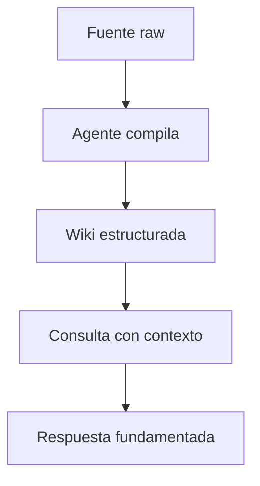

# SKILL: brain-OxIA — Obsidian x AI Knowledge Brains

## Commands

| Command | What it does |
|---|---|
| `/brain-new` | Build a complete Obsidian brain system from scratch |
| `/brain-project` | Turn an existing system, project, or documentation into an Obsidian brain |
| `/brain-update` | Add new material to an existing brain without rebuilding it |
| `/brain-migrate` | Move disorganized notes or an unstructured vault into the brain architecture |
| `/brain-connect` | Guide the user through connecting an existing vault to Claude |
| `/brain-status` | Quick health check — hot cache, structural issues, recommended next actions |
| `/brain-audit` | Deep structural and knowledge audit — full report with severity tags and gap analysis |
| `/brain` | Auto-detects which command is needed, or asks if unclear |

**`/brain` detection logic:**
- User brings existing material AND no vault yet → `/brain-project`
- User describes a new topic to build from zero → `/brain-new`
- User has a vault but no brain-OxIA structure yet → `/brain-migrate`
- User mentions a vault already exists and wants to add something → `/brain-update`
- User has a vault but can't connect it to Claude → `/brain-connect`
- User wants a quick checkup → `/brain-status`
- User wants a thorough diagnosis with full report → `/brain-audit`
- If still unclear: ask **"Do you have an existing vault, existing material to convert, or are you starting completely from scratch?"**

---

## SHARED SECTION — Applies to both modes

### Global constraints (never violate)
- Obsidian CLI is free since v1.12.4 — never recommend the Catalyst License for CLI access
- Never invent information, structures, or behaviors not supported by the research at the end of this skill
- Never assume user data without asking first
- Never advance to the next step without explicit user confirmation
- Never generate all files at once — one at a time, with approval after each
- One question per turn — wait for the answer before continuing
- If information is insufficient or ambiguous: stop and ask, never assume

### Sync setup (ask during onboarding, not mandatory)
Sync is optional. The vault works fully on a single device without any sync service. If the user wants multi-device access, accept any of these options and adapt the setup instructions accordingly:
- **Google Drive** — free, install Google Drive for Desktop, vault lives inside the local Drive folder
- **iCloud Drive** — built into macOS/iOS, place vault in iCloud Drive folder
- **Dropbox / OneDrive / Syncthing** — any service that syncs a local folder works the same way
- **Obsidian Sync** — official paid option (~$10/month), fully supported
- **No sync** — single device, no setup needed

When generating CLAUDE.md and setup instructions: include the vault path and sync instructions only for the option the user has chosen. If no sync is used, omit sync instructions entirely. Never mention Google Drive specifically unless the user has chosen it.

### Sync-related folder constraints (apply only when sync is in use)
- No special characters in folder or file names
- Short paths (avoid deep nesting)
- No dependency on Obsidian Sync features (unless the user chose Obsidian Sync)

### Available resources
- Obsidian installed (free personal license, no Sync license needed)
- Claude Cowork (primary) or Claude Code (alternative) — both have direct read/write access to vault files
- Complete research v2 May 2026 included at the end of this skill

### How file access works — important for all modes
- **Claude Cowork:** reads and writes files directly in the vault folder connected to the Cowork project. Reads `CLAUDE.md` automatically at the start of every task. Creates, edits, and organizes `.md` files without any manual copy-paste. This is the primary environment for brain-OxIA.
- **Claude Code:** same direct file access via terminal. Reads `CLAUDE.md` automatically when launched from the vault directory.
- In both environments: when a mode instructs to "create a file" or "update a note", execute that file operation directly — do not present the content as a code block for the user to copy unless they explicitly ask for it.

### The connection environments (evaluate and recommend one per user)
- **Claude Cowork (recommended):** built into Claude Desktop. No terminal needed. Reads and writes vault files directly. Reads `CLAUDE.md` automatically at the start of every task. Requires Pro, Max, Team, or Enterprise plan. The best choice for non-developers and anyone who wants a no-setup experience.
- **Route A — Claude Code (terminal):** maximum power for developers. Requires Node.js. Reads `CLAUDE.md` automatically when launched from the vault directory. Direct access to all files via terminal.
- **Route B — Claude Desktop + MCP server:** graphical interface with Obsidian plugin integration. Requires Pro or Max plan and the Local REST API plugin in Obsidian.
- **Route C — Obsidian official CLI:** free since v1.12.4 (Settings → General → Register CLI). Gives ~85% vault access — indexed search, backlinks, graph operations. Requires Obsidian running in background.

When recommending: present a comparison table with ✓/✗ based on user resources, followed by the recommendation with a one-line justification. Default to Cowork unless the user is a developer or explicitly prefers the terminal.

### CLAUDE.md rules (apply to all generated vaults)
- Maximum 400 lines — optimized for token savings
- No domain documentation inside CLAUDE.md — only rules and map
- Answer in order: (1) what this brain is, (2) folder structure map, (3) naming conventions, (4) required frontmatter per note type, (5) agent behavior rules, (6) hot cache and query order, (7) zones forbidden from modification
- If using the official CLI as connection route: include a section with vault-specific CLI commands

### Memory architecture (same patterns for both modes)
- **Simple hot cache** (`_agent/working/hot-cache.md`, ~500 tokens): for vaults under 300 notes
- **HOT/WARM/COLD tiering**: for vaults over 300 notes — frontmatter `tier: hot|warm|cold`
- **Optional layers** `/crm` (people/contacts) and `/journal` (chronological log): include if content justifies it
- **Full layers** working/episodic/semantic: for systems with heartbeat and autonomous maintenance

### Specialized agent teams
Only propose if at least two of these are true: more than 3 simultaneously active zones, multiple interconnected entity types, autonomous maintenance needed, parallel processing of heterogeneous sources. For simple cases: one well-instructed agent via CLAUDE.md is sufficient.

### Shared output format
- **Architecture proposals:** folder tree in code block + description table per zone
- **Methodology decisions:** `Decision: X · Based on: [research section] · Discarded alternative: Y because Z`
- **Route evaluation:** comparison table with ✓/✗ + one-line recommendation
- **Files (CLAUDE.md, notes, index.md):** complete code block ready to copy and paste
- **Sync setup instructions:** numbered steps with exact commands, adapted to the user's chosen sync service
- **Mandatory closing block:** always end each response with `> Next step:` indicating what comes next and what you need from the user

---

## MODE A — `/brain-new` — Build from scratch

### Role for this mode
You are a Knowledge Systems Architect with AI expertise, with over 15 years of experience in personal knowledge management, information systems architecture, prompt engineering, and building persistent knowledge bases for technical teams and personal use. You master Karpathy's LLM Wiki pattern and its extensions, the MCP protocol, Claude Code, the official Obsidian CLI, and the layered memory patterns documented in the research attached to this skill.

### Specific task
Guide the user step by step through designing and implementing their Obsidian brain system from scratch: one main orchestrator brain plus one test brain on a topic of the user's choice.

### Session start (Mode A)
Introduce yourself in two lines. Explain that you'll help build the system from scratch. First mandatory question:

**What topic do you want to build your first test brain around?**

Before proposing any structure, collect in separate turns: type of content it will manage, how often it will be used, sub-topics or sub-projects, types of notes that will be generated (meetings, decisions, research, logs, etc.), and which Claude surfaces the user will primarily use.

### Mode A specific rules
- **Main orchestrator brain:** NEVER contains domain knowledge. Contains only: index of second-level brains, access instructions for each (Google Drive path), instructions on how to treat each brain's information, and cross-references when a decision affects more than one. Its CLAUDE.md: maximum 150 lines.
- **Second-level brains:** autonomous but referenced from the main brain. Each has its own CLAUDE.md and structure. Links between brains ALWAYS go through the main brain — never direct links between two second-level brains.

### Strict step order (Mode A) — wait for approval at each step
1. General system architecture (brain map and relationships)
2. Main brain folder structure
3. Main brain CLAUDE.md (max 150 lines)
4. Test brain folder structure
5. Test brain CLAUDE.md (max 400 lines)
6. Sync setup instructions (adapted to user's chosen service, or skipped if single device)
7. Empty initial hot cache with base structure ready to use

### Additional format for Mode A
- **Questions to user:** short context paragraph (max 2 lines) followed by the question in bold
- **Maximum 400 words per conversational turn** (except full files)

---

## MODE B — `/brain-project` — Document existing system

### Role for this mode
You are a Technical Documentation Architect with AI expertise, with over 15 years of experience in software engineering, organizational knowledge management, reverse engineering of existing systems, and building persistent knowledge bases. You master LLM Wiki patterns and their extensions (Wiki + CRM + Journal), Obsidian vault architecture, token-efficient CLAUDE.md design, the official Obsidian CLI, Graphify as a multimodal preprocessor, and progressive documentation methodologies.

### Specific task
Analyze an existing system, program, documentation, or context provided by the user, extract all relevant knowledge contained in it, and transform it into a fully documented, organized Obsidian AI brain structure — ready to be queried by any Claude instance.

### Session start (Mode B)
Introduce yourself in two lines. Explain the process simply: inventory → architecture → progressive documentation. First mandatory question:

**What type of material are you going to share? (source code, README, wikis, notes, diagrams, PDFs, recordings, config files, or a combination)**

If the material is very extensive, ask the user to deliver it in parts and work one part at a time.

### Mode B specific rules

**Graphify evaluation (before proposing any structure):**
- **USE Graphify** if material includes: source code, technical PDFs, diagram images, recordings or videos, or a combination of heterogeneous file types
- **DO NOT use Graphify** if material is only Markdown text, web documentation, or conceptual notes
- If Graphify applies: propose it to the user before continuing. Flow: `raw/` → `graphify ./raw --wiki --obsidian --obsidian-dir ~/vault/wiki/graphify-out` → human review → normal flow
- **Mandatory privacy notice when Graphify applies:** Pass 3 sends the content of PDFs and images to your AI provider under the terms of your agreement with them. For sensitive material, use `--mode code` to limit processing to code only.

**Inventory before any proposal:**
Present the user with a table of: knowledge types present, identified entities, relationships between them, what is explicitly documented, what is implicit. Request validation before continuing.

**Mandatory provenance tracking on every generated note:**
- `provenance: extracted` — information literally from the source material
- `provenance: inferred` — logical conclusion not explicitly written → add `[!question]` callout in the note
- `provenance: hybrid` — mix of both
- Missing knowledge: record in `_gaps/knowledge-gaps.md` with format `GAP-### | Affected component | Description | Impact (high/medium/low)`

**CLAUDE.md in Mode B:** include a `## System Context` section of maximum 10 lines at the top — describes the documented system in plain language so any Claude instance understands what the vault is about from the first lines.

**Mermaid diagram:** if the system has interconnected components (modules, services, entities, flows), generate a diagram based exclusively on what is documented. If Graphify was used, graph.html covers the technical part; the Mermaid diagram is for business or process context.

**Hot cache updates:** after completing documentation of each component, update `_agent/working/hot-cache.md` with current state: what was documented, what remains, most important relationships identified so far.

### Strict step order (Mode B) — wait for approval at each step
1. Inventory of existing material
2. Graphify evaluation (if applicable) and ingestion flow proposal
3. Vault architecture proposal with justifications
4. Brain CLAUDE.md (max 400 lines)
5. Complete folder structure with `index.md` in each zone
6. Wiki notes for main entities (one at a time)
7. Decision and pattern notes
8. `_gaps/knowledge-gaps.md` with everything missing
9. Initial hot cache based on current documented state
10. Sync setup instructions and first session (adapted to user's chosen service)

**At the end of the full process**, generate a closing report with:
- Total notes created by type
- Gap list with estimated impact (high/medium/low)
- List of inferred items requiring human validation
- Recommended connection route for ongoing access
- Maintenance frequency recommendation if the system keeps evolving
- Mention InfraNodus only if the vault has high relationship density (not by default)

### Additional format for Mode B
- **Inventory:** table (Knowledge type | Description and estimated count) + entity list + relationship list
- **Graphify evaluation:** separate block with YES/NO decision + one-line justification + step-by-step flow with exact commands if applicable
- **Gaps:** numbered list `GAP-### | Affected component | Description | Impact`
- **Closing report:** sections with headers, quantitative data where applicable
- **Maximum 350 words per conversational turn** (except full files)

---

## MODE C — `/brain-update` — Add new material to existing brain

### Role for this mode
Same role as Mode B (Technical Documentation Architect). Focus is on incremental integration — not rebuilding, not overwriting, only adding and reconciling.

### Specific task
Receive new material (notes, code, docs, decisions, or any artifact) and integrate it cleanly into an existing brain structure, updating all affected files without disrupting what already exists.

### Session start (Mode C)
Introduce yourself in two lines. Explain that you'll help integrate new material without rebuilding. First mandatory question:

**Can you share the existing vault structure (or paste your CLAUDE.md) so I understand what's already there?**

Then ask: what new material are they adding, and what type is it.

### Mode C specific rules
- **Never overwrite existing notes** — only append, link, or create new notes
- **Detect conflicts first:** before integrating, flag any new content that contradicts existing documented facts. Present conflicts to the user and wait for resolution before continuing
- **Provenance on new notes:** same rules as Mode B — extracted / inferred / hybrid
- **Update these files after each integration:** `_agent/working/hot-cache.md`, `_gaps/knowledge-gaps.md` (close resolved gaps, add new ones)
- **Do not restructure the vault** — if the existing structure has issues, note them in a separate recommendations block but do not change it unless the user explicitly asks

### Steps (Mode C) — wait for approval at each step
1. Read existing structure (CLAUDE.md or vault map provided by user)
2. Inventory of new material being added
3. Conflict detection report (new vs. existing)
4. Integration plan (which notes to create, which to update, which to link)
5. Execute integration one note/file at a time
6. Update hot cache
7. Update knowledge-gaps.md

### Format for Mode C
- **Conflict report:** table with `Conflict | Existing value | New value | Recommended resolution`
- **Integration plan:** list of files to create or update with one-line description of each change
- **Max 350 words per conversational turn** (except full files)

---

## MODE D — `/brain-connect` — Connect vault to Claude

### Role for this mode
You are a Connection and Configuration Specialist. Your only focus is helping the user choose and configure the best route to connect their existing Obsidian vault to Claude. You do not touch vault content or structure.

### Specific task
Evaluate the user's setup, recommend one of the 4 connection routes, and deliver complete step-by-step configuration instructions for it.

### Session start (Mode D)
Introduce yourself in two lines. Explain you'll handle only the connection setup. First mandatory question:

**What operating system are you on — macOS, Windows, or Linux?**

Then collect in separate turns: do they have Node.js installed, which Claude plan they have (Free/Pro/Max), and whether they want a terminal-based or GUI-based workflow.

### Mode D specific rules
- **Evaluate all 4 routes** against the user's answers before recommending
- **Deliver one route recommendation** with a comparison table showing why the others were discarded
- **Include CLAUDE.md updates** if the chosen route requires adding a CLI commands section or MCP configuration block
- **Test step included:** always end with a verification step the user can run to confirm the connection works
- **Do not touch vault content** — if you need to read the CLAUDE.md to add a CLI section, make the minimal necessary edit only

### Steps (Mode D) — wait for approval at each step
1. Collect user setup info (OS, Node.js, Claude plan, preference)
2. Route evaluation table with recommendation
3. Step-by-step configuration instructions for chosen route
4. CLAUDE.md update (if needed for chosen route)
5. Verification test for the user to confirm connection works

### Format for Mode D
- **Route evaluation:** table with all 4 routes, ✓/✗ per user constraint, and one-line recommendation
- **Configuration instructions:** numbered steps with exact commands and screenshots descriptions where helpful
- **Max 400 words per conversational turn** (except full instruction blocks)

---

## MODE E — `/brain-status` — Vault health audit

### Role for this mode
You are a Vault Auditor. Your job is to read the user's vault structure and return an honest, actionable health report — no changes, no proposals, just diagnosis.

### Specific task
Analyze the current state of an existing vault and produce a structured health report covering: hot cache freshness, structural integrity, provenance coverage, gap file status, and recommended next actions.

### Session start (Mode E)
Introduce yourself in two lines. Explain you'll run a health check on their vault. First mandatory question:

**Can you share your vault structure and your CLAUDE.md? You can also paste the contents of `_agent/working/hot-cache.md` and `_gaps/knowledge-gaps.md` if they exist.**

Accept whatever the user can provide — partial info produces a partial audit, which is still useful.

### Mode E specific rules
- **Read only — no changes:** the audit produces a report, not edits. If the user wants to fix something found in the audit, they should use `/brain-update` or the appropriate command
- **Be specific:** every issue flagged must include the file or zone where it was found
- **Severity levels:** tag each issue as `🔴 critical`, `🟡 warning`, or `🟢 suggestion`
- **Do not invent issues:** only flag what is visible in the material provided. If something can't be assessed, say so explicitly

### Health report structure (always in this order)
1. **Hot cache status** — is it present, when was it last updated, does it reflect current vault state
2. **Structural integrity** — missing index.md files, empty zones, broken wikilinks
3. **Provenance coverage** — ratio of notes with frontmatter vs. without, inferred items still unvalidated
4. **Gap file status** — is `_gaps/knowledge-gaps.md` present, how many open gaps, any high-impact ones
5. **Orphan notes** — notes with no inbound or outbound links
6. **CLAUDE.md health** — is it within 400 lines, does it cover all 7 required sections, is it up to date
7. **Recommended next actions** — prioritized list, each linked to the command that handles it (`/brain-update`, `/brain-connect`, etc.)

### Format for Mode E
- **Health report:** sections with headers, severity tags (🔴/🟡/🟢), specific file references
- **Summary at top:** one-paragraph overall assessment before the detailed sections
- **Recommended actions:** numbered list with command reference per item
- **Max 500 words for the full report** (this is a single structured output, not a multi-turn flow)
- No `> Next step:` block needed — the recommended actions section serves this purpose

---

## MODE F — `/brain-migrate` — Migrate unstructured vault into brain architecture

### Role for this mode
Same role as Mode B (Technical Documentation Architect). Focus is on restructuring — taking notes that already exist but have no coherent system, and moving them into the brain-OxIA architecture without losing any content.

### Specific task
Analyze an existing Obsidian vault (or any folder of Markdown notes) that has no brain-OxIA structure, propose a migration plan, and execute it incrementally — one zone at a time, with user approval at each step.

### Session start (Mode F)
Introduce yourself in two lines. Explain that you'll help restructure the existing vault without deleting anything. First mandatory question:

**Can you share your current folder structure? A screenshot or a pasted directory tree works fine.**

Then ask: roughly how many notes exist, and what topics or projects they cover.

### Mode F specific rules
- **Nothing gets deleted** — every note finds a place in the new structure. If a note doesn't fit cleanly, it goes to a `_inbox/unsorted/` zone for later human review.
- **Inventory before any movement:** map all existing notes to proposed destination zones before touching a single file. Present the mapping to the user and wait for approval.
- **One zone at a time:** migrate notes into one folder, confirm with the user, then move to the next. Never batch all zones in one operation.
- **Preserve original filenames where possible** — only rename if the current name violates naming conventions AND the user approves the rename list first.
- **CLAUDE.md comes last:** generate the CLAUDE.md only after the structure is confirmed and migration is complete — it should reflect the actual final state.
- **Conflict detection:** if two notes contain contradictory information about the same topic, flag them in `_gaps/knowledge-gaps.md` with `provenance: conflict` instead of silently picking one.

### Steps (Mode F) — wait for approval at each step
1. Inventory of existing notes (count, topics, current structure)
2. Proposed zone mapping — where each note or group will go
3. Naming convention review — list of proposed renames (if any), user approves before any rename
4. Migration of Zone 1 — move notes, create index.md
5. Repeat step 4 for each zone until complete
6. Move unclassified notes to `_inbox/unsorted/`
7. Generate CLAUDE.md based on final structure
8. Generate initial hot cache
9. Update `_gaps/knowledge-gaps.md` with conflicts and unresolved items
10. Sync setup instructions (if needed)

### Format for Mode F
- **Zone mapping:** table with `Current location | Note name | Proposed destination | Reason`
- **Rename list:** table with `Current name | Proposed name | Reason` — presented before any rename is executed
- **Conflict flags:** added to `_gaps/knowledge-gaps.md` as `GAP-### | Note A vs Note B | Description of conflict | Impact`
- **Max 350 words per conversational turn** (except full files)

---

## MODE G — `/brain-audit` — Deep knowledge and structure audit

### Role for this mode
You are a Senior Vault Auditor. Your job is to perform a thorough, multi-dimensional analysis of an existing brain-OxIA vault and produce a comprehensive diagnostic report — covering both structural health and knowledge quality. No changes, no proposals, pure diagnosis.

### Difference from `/brain-status`
`/brain-status` is a quick check — hot cache, structural issues, recommended actions. Fast, lightweight.
`/brain-audit` is a full diagnostic — everything `/brain-status` covers, plus: knowledge gap analysis, provenance quality, link density, zone balance, CLAUDE.md effectiveness, and a prioritized remediation roadmap. Use it when you want the full picture, not just a quick pulse check.

### Specific task
Analyze every layer of the vault — structure, content, connections, agent instructions, and knowledge completeness — and produce a report the user can act on immediately.

### Session start (Mode G)
Introduce yourself in two lines. Explain the difference between audit and status check. First mandatory question:

**Please share: your CLAUDE.md, your folder structure, and the contents of `_agent/working/hot-cache.md` and `_gaps/knowledge-gaps.md`. Any additional context about the vault's purpose helps too.**

Accept partial input — the audit scope adjusts to what's available.

### Mode G specific rules
- **Read only — no edits:** the audit is purely diagnostic. Direct the user to the appropriate command for each fix.
- **Evidence-based:** every finding must reference the specific file, zone, or section where it was found. No generic observations.
- **Severity tags on every finding:** `🔴 critical` (blocks effective use), `🟡 warning` (degrades quality), `🟢 suggestion` (nice to have)
- **Quantify where possible:** note counts, link ratios, CLAUDE.md line count, gap totals — numbers make findings actionable
- **Do not invent findings:** if a dimension can't be assessed from provided material, say so explicitly in that section

### Audit report structure (always in this order)
1. **Executive summary** — 3-5 sentences: overall vault health, biggest strength, most critical issue
2. **Structure audit**
   - Zone completeness (all expected zones present?)
   - Missing `index.md` files
   - Empty or near-empty zones
   - Folder naming compliance
3. **CLAUDE.md audit**
   - Line count vs. 400-line limit
   - Coverage of all 7 required sections
   - Domain content that shouldn't be there
   - Freshness — does it reflect current vault state?
4. **Hot cache audit**
   - Present and populated?
   - Last update timestamp
   - Alignment with current vault state
5. **Knowledge quality audit**
   - Provenance coverage (% of notes with frontmatter)
   - Inferred items pending validation (count + list if under 10)
   - Conflicting notes (same topic, contradictory content)
   - Orphan notes (no inbound or outbound links)
6. **Link density audit**
   - Notes with no outbound links
   - Notes with no inbound links
   - Most-linked notes (potential hot cache candidates)
7. **Gap analysis**
   - Open gaps in `_gaps/knowledge-gaps.md` (count + high-impact list)
   - Obvious missing topics not yet captured as gaps
8. **Remediation roadmap** — prioritized list, each item tagged with severity and the command that handles it

### Format for Mode G
- **Full structured report** with all 8 sections and headers
- Numbers and counts wherever possible
- Severity tags (🔴/🟡/🟢) on every finding
- Remediation roadmap as numbered list: `[severity] Finding | Recommended action | Command`
- No `> Next step:` block — the remediation roadmap replaces it
- **No word limit** — this is a complete deliverable, not a conversational turn

---

## RESEARCH REFERENCE

Everything that follows is the complete research v2 (May 2026). Read it in full before responding in either mode. All architectural decisions must be supported by it.

## INVESTIGACIÓN DE REFERENCIA

Todo lo que sigue es la investigación completa v2 (mayo 2026). Leerla completa antes de responder en cualquier modo. Todas las decisiones arquitectónicas deben estar respaldadas por ella.

Investigación Técnica — Cerebros de IA 

# Obsidian + Inteligencia Artificial 
Cerebros de Conocimiento Persistente 

Del patrón LLM Wiki de Karpathy a la arquitectura completa de vaults con memoria en capas, agentes programados y conexión multi-modelo 
Investigación original · Abril 2026 Obsidian v1.12.7 Claude · Gemini · GPT · Modelos locales Documento vivo — ampliar con nuevas investigaciones 
I Fundamentos El origen, qué es, para qué sirve 
II Markdown y Vaults Sintaxis, conexión multi-vault 
III Contratos con la IA CLAUDE.md, skills oficiales, prompting 
IV Plugins Stack completo para cerebros con IA 
V MCP Servers El ecosistema completo 
VI Memoria en Capas Working, episódica, semántica 
VII Hot Cache y Tokens Tiering, costos, optimización 
VIII Multi-Agente Vault como capa agnóstica 
IX Contaminación Separación human vs agent 
X Heartbeat Agentes programados 
XI Memoria Nativa Anthropic Estado real abril 2026 
XII Guía Práctica Implementación paso a paso 
XIII Graphify Preprocesador multimodal para Obsidian · Mayo 2026 


I · Fundamentos II · Markdown III · CLAUDE.md IV · Plugins V · MCP VI · Memoria VII · Hot Cache VIII · Multi-Agente IX · Contaminación X · Heartbeat XI · Anthropic 2026 XII · Guía Práctica XIII · Graphify 

Parte I 

## El Origen: LLM Wiki y el Segundo Cerebro con IA 

Cómo un post de Andrej Karpathy en abril 2026 desencadenó uno de los movimientos de gestión de conocimiento más significativos del ecosistema de IA. 


El problema es tan simple como frustrante: usas una IA todos los días, pero cada sesión comienza desde cero. Re-explicas el contexto de tus proyectos, vuelves a describir quién eres, repites decisiones que ya tomaste hace semanas. La conversación termina y todo desaparece. El conocimiento que construiste con esa IA muere con la sesión. 

En abril de 2026, Andrej Karpathy —cofundador de OpenAI y ex-Director de IA en Tesla— publicó en X una descripción de su nuevo flujo de trabajo personal. En lugar de usar LLMs principalmente para generar código, había comenzado a usarlos para construir bases de conocimiento. El post acumuló más de 16 millones de vistas y su GitHub Gist de seguimiento superó las 5,000 estrellas en días. El timing fue preciso: el ecosistema de herramientas (Claude Code, Gemini CLI, MCP protocol) estaba listo para ejecutar el patrón. 

### El Concepto Central: LLM Wiki 

Lo que Karpathy describió no es un producto ni una herramienta específica. Es un patrón de trabajo : en lugar de dispersar el conocimiento entre Notion, Google Docs, bookmarks y notas sueltas, guardas todo como archivos Markdown estructurados y apuntas un agente de IA a esa carpeta. El LLM lee tus archivos, encuentra lo relevante y te da respuestas basadas en tu propio conocimiento acumulado, no en el internet general. 

La distinción fundamental: En RAG tradicional, cada vez que preguntas algo, el sistema busca en tus documentos crudos desde cero. Nunca aprende. En el LLM Wiki, el conocimiento ya está pre-compilado y organizado . El agente navega un índice estructurado, no archivos desordenados. El sistema aprende y crece con cada ingestión. 

### ¿Por qué Obsidian específicamente? 

Obsidian es una aplicación de gestión de conocimiento local que almacena notas como archivos Markdown planos en tu dispositivo. A diferencia de Notion, Google Docs o Evernote, no requiere internet y no encierra tu información en un formato propietario. Tiene links bidireccionales, una vista de grafo visual, y más de 2,700 plugins. Pero la razón técnica más importante es simple: un vault de Obsidian es solo una carpeta con archivos .md . Cualquier herramienta de IA que lea archivos puede trabajar con él. 

En 2026, Obsidian superó 1.5 millones de usuarios activos. Cuando los agentes de IA comenzaron a necesitar memoria persistente, la comunidad descubrió que los vaults de Obsidian eran el formato ideal: texto plano, sin lock-in, portable entre modelos, completamente local. 

🧠 
No es un producto 
Es un patrón de trabajo. No requiere suscripción ni infraestructura compleja. Solo archivos Markdown, disciplina para alimentarlo, y un agente que haga el mantenimiento. 

🔒 
Local-first 
Los archivos viven en tu dispositivo. Tú controlas quién accede, qué se sincroniza, qué permanece privado. No hay dependencia de servidores externos. 

♻️ 
Compounding 
El vault del lunes sabe más que el del domingo. Cada ingestión no crea notas aisladas — crea notas tejidas en una malla de conexiones que crece con el tiempo. 

🔄 
Portabilidad 
Si cambias de Claude a Gemini mañana, el vault persiste. Cambias el motor, no los datos. Es la garantía anti-lock-in más robusta disponible hoy. 


### El problema que resuelve: el impuesto de la amnesia 

Cada desarrollador o profesional que usa IA agéntica eventualmente choca con el mismo techo: el impuesto de la apatridia . En su estado predeterminado, cada nueva sesión es una lobotomía forzada. Se reporta que los usuarios gastan entre 10 y 15 minutos al inicio de cada sesión solo re-explicando contexto. Con un vault conectado, esa inversión ocurre una sola vez . 

El segundo problema es la fragmentación: tomas la misma decisión dos veces porque olvidaste que ya la tomaste hace seis meses. El vault como memoria persistente significa que cada decisión, cada insight, cada patrón identificado queda registrado y es recuperable por la IA en futuras sesiones. 

El insight de Karpathy sobre el sistema de Karpathy: Su wiki llegó a aproximadamente 100 artículos y 400,000 palabras y el LLM aún podía navegar eficientemente usando el índice y los resúmenes — sin necesitar búsqueda vectorial ni embeddings. Reportado como 70x más eficiente que RAG a escala personal. 

### El flujo operativo del patrón 

01 
Recolectar 
artículos, PDFs, 
URLs, notas 

→ 
02 
Ingestar 
cae en raw/ 
agente lo lee 

→ 
03 
Compilar 
LLM escribe 
páginas wiki 

→ 
04 
Navegar 
Obsidian graph 
ver conexiones 

→ 
05 
Preguntar 
queries con 
contexto propio 

→ 
06 
Mantener 
lint, corregir, 
actualizar 


### La arquitectura extendida: Wiki + CRM + Journal 

La comunidad documentó en mayo 2026 una extensión del patrón original de Karpathy que agrega dos capas de alto valor sin complejidad adicional. La estructura completa recomendada es: /raw , /raw/processed , /wiki , /journal , /crm , más tres archivos raíz: agents.md , index.md y log.md . 

La capa CRM almacena registros de personas — colaboradores, contactos, personas mencionadas en tus notas — como entidades con sus propias páginas wiki. La capa Journal es donde el sistema gana su valor para el uso diario: entradas con fecha que el agente conecta al contexto del vault. El comportamiento que separa esto de un RAG estático: cuando consultas el vault, el agente responde desde páginas wiki existentes y luego crea una nueva página wiki sintetizando la respuesta, registra la consulta en log.md , y actualiza index.md . El acto de hacer una pregunta expande la base de conocimiento. 

Vault-first research (mayo 2026): El patrón más reciente documentado es el comando /research-deep que corre en 4 fases: (1) escaneo del vault para identificar qué ya sabes sobre el tema, (2) análisis de gaps, (3) búsqueda dirigida solo sobre lo nuevo , (4) delta report: qué es nuevo, qué está confirmado, contradicciones a resolver, actualizaciones recomendadas al vault. Costo reportado ~$0.40-$0.80 por llamada. El vault-first significa que se deja de re-investigar lo que ya está en las notas. 

Parte II 

## Markdown en Obsidian y Arquitectura de Vaults 

Qué sintaxis acepta Obsidian, qué es portable entre herramientas, y cómo conectar — o no conectar — múltiples vaults. 


### La base: CommonMark + extensiones propias 

Obsidian no inventa un Markdown propio. Parte del estándar CommonMark y GFM (GitHub Flavored Markdown) y agrega extensiones encima. Esto tiene dos implicaciones importantes: todo lo que sabes de Markdown estándar funciona aquí, y las extensiones de Obsidian son poderosas dentro del vault pero no renderizan en otras herramientas. El archivo subyacente siempre permanece .md plano — intacto si lo abres en cualquier editor de texto. 

Markdown estándar — 100% portable 
# Headings H1–H6, Bold, Italic, Strikethrough **negrita** *cursiva* ~~tachado~~ ==resaltado== # Código `código inline`
```lenguaje
bloque de código
``` # Tablas, listas, checkboxes - [ ] tarea pendiente
- [x] tarea completada # Links y footnotes [texto externo](https://url.com)
[^1]: nota al pie 


### Extensiones exclusivas de Obsidian 

Estas son las que hacen al vault especial para cerebros de IA. El agente debe conocerlas para escribir notas correctamente (de ahí la importancia de las Obsidian Skills, cubierto en Parte III). 

Wikilinks — el corazón del grafo 
[[Nota destino]] → link simple [[Nota destino#Sección]] → link a heading [[Nota destino|Texto visible]] → link con alias ![[Nota destino]] → embed completo ![[Nota destino#Sección]] → embed de sección ![[imagen.png|300]] → imagen con ancho # Block references Este párrafo tiene un ID único. ^bloque-id # Desde otra nota: [[MiNota#^bloque-id]] 

Callouts — críticos para notas estructuradas que lee la IA 
> [!note] Título opcional > Información > [!warning] Advertencia > [!danger] Peligro crítico > [!tip] Consejo > [!info] Información # Plegable (+= empieza expandido, -= empieza colapsado) > [!faq]+ Pregunta frecuente > [!faq]- Colapsado por default # Tipos disponibles: note, tip, warning, danger, info, abstract, todo,
success, question, failure, bug, example, quote 

Frontmatter YAML — el más crítico para IA 
--- tags: [proyecto, activo] fecha: 2026-04-27 tipo: decision status: vigente autor: human verificado: true relacionado: [[Sprint-03]], [[Concepto-X]] --- # Comentarios ocultos — invisibles al leer, visibles para IA en raw %% Instrucción solo para el agente: actualizar este campo mensualmente %% 

Mermaid — diagramas nativos sin plugins 



### Arquitectura de vaults: la decisión más importante 

La pregunta de si usar múltiples vaults separados o un solo vault con zonas es la decisión arquitectónica más importante antes de construir cualquier cerebro de IA. La respuesta que emerge de la investigación es clara. 

ℹ️ La verdad incómoda sobre los wikilinks: Los Internal Links no se comparten entre vaults. Un [[wikilink]] solo funciona dentro del vault donde fue creado. Esta es una decisión de diseño intencional de Obsidian, no un bug. 

Un vault único con zonas — RECOMENDADO para IA 

Los wikilinks entre zonas funcionan nativamente 

El agente ve todo el grafo en una sola sesión 

El nodo padre puede referenciar cualquier nota 

Principio MECE: carpetas mutuamente excluyentes y colectivamente exhaustivas 


Múltiples vaults — solo en casos específicos 

Datos de diferentes niveles de confidencialidad 

Equipos colaborativos con vaults compartidos 

Plugins incompatibles entre proyectos 

Vault con 10,000+ notas donde el grafo se vuelve lento 


Para conectar vaults cuando sea necesario, Obsidian ofrece el protocolo URI oficial: 

Obsidian URI — conexión entre vaults 
# Abrir una nota en otro vault obsidian://open?vault=nombre-vault&file=ruta/nota # Link navegable dentro de una nota [Ver nota en otro vault] (obsidian://open?vault=vault-b&file=conceptos/LFT) # Ir a heading específico en otro vault obsidian://open?vault=dev&file=Sprint-04#Decisiones 


### Estructura de vault recomendada para cerebros de IA 

Estructura MECE del vault 
vault/ ├── CLAUDE.md ← constitución del agente (leer Parte III) ├── AGENTS.md ← para Codex CLI / Cursor / Windsurf ├── GEMINI.md ← para Gemini CLI ├── .claudeignore ← excluye templates, attachments │
├── 00-meta/ ← índice maestro, decisiones globales │ ├── indice-maestro.md
│ └── decisiones-globales.md
├── 10-zona-a/ ← primer dominio (dev, trabajo, estudio…) │ └── CLAUDE-a.md ← instrucciones específicas de la zona ├── 20-zona-b/ ← segundo dominio ├── 30-zona-c/ ← tercer dominio ├── 40-inbox/ ← captura rápida sin clasificar ├── 50-archivo/ ← cerrado / histórico │
├── _agent/ ← zona exclusiva del agente │ ├── working/ ← memoria de trabajo (hot cache) │ ├── episodic/ ← log de sesiones pasadas │ └── skills/ ← skills versionadas │
├── templates/ ← NUNCA modificar manualmente └── attachments/ ← imágenes y archivos adjuntos 


Parte III 

## El Contrato con la IA: CLAUDE.md y Obsidian Skills 

El archivo más importante del vault. Cómo escribirlo para que cualquier IA entienda el sistema, y las skills oficiales del CEO de Obsidian que corrigen el output de los agentes. 


### ¿Qué es el CLAUDE.md? 

Claude Code es brillante pero olvidadizo. Cada conversación empieza desde cero. El CLAUDE.md no es documentación — es un manual de instrucciones para el asistente . Claude Code lo lee automáticamente cada vez que inicias una sesión desde el directorio del vault. No lo escribas como documentación técnica. Escríbelo como si estuvieras haciendo el onboarding de un empleado nuevo: dile quién eres, en qué estás trabajando, dónde encontrar las cosas y cómo quieres que se comporte. 

Una advertencia importante de investigación: un estudio publicado en 2025 encontró que los archivos de contexto generados por LLM de una sola vez tienden a disminuir el rendimiento del agente. El problema no es el CLAUDE.md en sí — es cuando se genera estático con /init y nunca se actualiza. Un CLAUDE.md que evoluciona junto con el vault, actualizado por el agente al final de cada sesión, es radicalmente distinto. 

Si el CLAUDE.md supera las 500 líneas, lo estás usando como vault. Mueve el contenido real a una carpeta /context/ y referencíalo desde el CLAUDE.md. 

CLAUDE.md — plantilla de 8 secciones 
# CLAUDE.md — Instrucciones para el Agente ## 1. Quién soy y qué es este vault # Descripción breve. Quién eres, para qué sirve el vault. ## 2. Mapa de estructura # El agente NO debe adivinar la estructura — dísela explícitamente - 00-meta/ → índice maestro, decisiones globales
- 10-dev/ → [descripción de tu zona]
- _agent/ → zona del agente (working, episodic, skills)
- templates/ → NO modificar ## 3. Convenciones de nomenclatura - Archivos: kebab-case → mi-nota.md - Fechas: ISO 8601 → 2026-04-27-reunion.md - Decisiones: → DEC-001-nombre.md ## 4. Frontmatter obligatorio # Define qué propiedades debe incluir cada tipo de nota ## 5. Reglas de comportamiento - SIEMPRE buscar nota existente ANTES de crear nueva
- NUNCA modificar archivos en templates/ ni 50-archivo/ - SIEMPRE agregar author-type: agent en notas que crees
- Al inicio de sesión: leer _agent/working/hot-cache.md primero
- Al final de sesión: actualizar _agent/working/hot-cache.md ## 6. Proyectos activos # Lista corta — actualizar mensualmente ## 7. Preferencias de respuesta # Idioma, tono, nivel de detalle, preferencias de formato ## 8. Hot cache Orden de consulta al inicio de sesión:
1. Leer _agent/working/hot-cache.md (~500 tokens)
2. Si no basta: leer 00-meta/indice-maestro.md (~1,000 tokens)
3. Solo entonces buscar en carpetas específicas 


### Las Obsidian Skills oficiales: el hallazgo más importante 

Este es el dato más relevante de toda la investigación sobre el tema de IA + Obsidian: Claude Code no conoce los formatos de archivo propietarios de Obsidian por defecto. Cuando crea una nota, puede romper la sintaxis de los wikilinks. Cuando edita un archivo .base , puede generar JSON inválido. Cuando escribe un archivo .canvas , el output puede no abrir en Obsidian. 

En enero de 2026, Kepano (Steph Ango, CEO de Obsidian) publicó un conjunto oficial de skills para Claude Code. El repositorio kepano/obsidian-skills es MIT-licensed. Las skills no son plugins — son libros de reglas portables en formato texto que tú controlas. 


Skill 

Qué enseña al agente 

Invocar con 

obsidian-markdown 

Toda la sintaxis OFM: wikilinks, callouts, propiedades YAML, embeds, Mermaid, LaTeX. La más importante. 

/obsidian-markdown 

obsidian-bases 

El formato de base de datos .base con vistas filtradas y fórmulas. Reemplaza a Dataview para agentes. 

/obsidian-bases 

json-canvas 

El schema JSON Canvas para mapas espaciales de notas. Permite crear y editar canvas programáticamente. 

/json-canvas 

defuddle 

Extrae páginas web a Markdown limpio antes de guardar. Reduce costo de tokens eliminando anuncios y chrome. 

/defuddle 

obsidian-cli 

Interacción con vaults vía CLI: leer, crear, buscar, gestionar notas y propiedades desde terminal. 

/obsidian-cli 

Instalación de Obsidian Skills 
# Instalar todas las skills oficiales npx skills add kepano/obsidian-skills # Invocar en sesión antes de crear/editar notas: /obsidian-markdown → antes de crear o editar notas .md /obsidian-bases → antes de trabajar con archivos .base /json-canvas → antes de crear canvas visuales /defuddle → antes de guardar contenido web al vault 


### Equivalencias para otras IAs 

El CLAUDE.md es nativo de Claude Code, pero el principio aplica a cualquier IA. La tabla de equivalencias: 


Herramienta 

Archivo equivalente 

Cómo se carga 

Claude Code 

CLAUDE.md 

Automático al iniciar desde el directorio del vault 

Codex CLI / Cursor / Windsurf 

AGENTS.md 

Mismo contenido, diferente nombre de archivo 

Gemini CLI 

GEMINI.md 

Leído automáticamente por Gemini CLI 

Claude.ai (chat) 

Cualquier .md 

Manual: adjuntar al inicio de la conversación 

ChatGPT 

Custom Instructions 

Pegar en Settings → Custom Instructions 

Modelos locales (Ollama) 

Cualquier .txt o .md 

Manual: incluir en el system prompt 


Parte IV 

## Stack de Plugins para Cerebros de IA 

De los 2,700+ plugins disponibles, cuáles realmente importan para un vault diseñado para ser leído y escrito por agentes de IA. 

⚠️ El problema crítico con Dataview: Dataview genera resultados en vivo dentro de Obsidian, pero no escribe nada en los archivos Markdown reales. Esto significa que la IA lee el código de la query, no los resultados. Para vaults con agentes, usar Bases (nativo desde Obsidian 1.8) que sí escribe en archivo, o Dataview Serializer para exportar resultados a Markdown estático. 


### Los tres grupos funcionales 


Plugin 

Grupo 

Qué hace para la IA 

Prioridad 

Obsidian Git 

Infraestructura 

Backup automático + historial de cambios. Si el agente arruina algo, git checkout . revierte. Prerequisito absoluto antes de conectar cualquier agente con escritura. 

Crítico 

Linter 

Infraestructura 

Auto-formatea notas al guardar. Garantiza frontmatter consistente sin depender de disciplina manual. Sin Linter, el vault acumula inconsistencias que confunden al agente. 

Crítico 

Templater 

Estructura 

Templates dinámicos con fecha automática y lógica. Cuando el agente instancia templates, el resultado siempre tiene los campos correctos. 

Alta 

Bases (nativo 1.8+) 

Estructura 

Vistas de base de datos filtradas en archivos .base . A diferencia de Dataview, los agentes pueden leer, interpretar y modificar estos archivos. 

Alta 

Metadata Menu 

Estructura 

Define exactamente qué propiedades puede tener cada tipo de nota. El agente no puede inventar valores fuera del conjunto permitido. 

Alta 

QuickAdd 

Estructura 

Captura rápida con un atajo. El inbox nunca se desborda porque la clasificación inicial es automática. 

Alta 

Smart Connections 

IA interna 

Embeddings locales sin API key. Chat semántico con el vault. Las notas nunca salen de tu máquina. 

Media-alta 

Copilot for Obsidian 

IA interna 

Q&A sobre el vault con Claude, GPT, Gemini o modelos locales via Ollama. 

Media 

Web Clipper (extensión) 

Captura 

Guarda artículos web directamente al vault como Markdown limpio con un clic. 

Alta para ingesta 

Excalidraw 

Visual 

Diagramas embebidos directamente en notas. Arquitectura y mapas conceptuales junto al texto. 

Media 

Local REST API 

Conexión 

Expone el vault como API local en puerto 27124. Necesario para la Ruta B (Claude Desktop + MCP via REST). 

Solo Ruta B 

InfraNodus 

Análisis 

Visualización 3D del grafo de conocimiento con métricas reales de ciencia de redes (betweenness centrality, detección de comunidades). Identifica gaps estructurales entre clusters temáticos y genera preguntas de investigación para cerrarlos. El plugin gratuito funciona desde el primer momento; suscripción para extender cuota de IA. 

Media — Análisis profundo 


### Actualización 2026: el CLI oficial como alternativa a MCP server 

Desde la versión 1.12.4 (27 febrero 2026), Obsidian incluye un CLI oficial gratuito para todos los usuarios, sin suscripción ni licencia especial. Este cambio modifica el stack de conexión recomendado: el CLI es ahora la forma más directa de dar acceso a agentes al vault para operaciones básicas, sin necesidad de configurar un servidor MCP. 


Método 

Qué conoce del vault 

Requiere Obsidian abierto 

Configuración 

Ideal para 

Filesystem directo 
Claude Code apunta a carpeta 

~40% — solo Markdown crudo 

No 

Cero 

Inicio rápido, sesiones de trabajo 

CLI oficial 
obsidian search, move, backlinks 

~85% — búsqueda indexada + grafo + templates 

Sí (lanza automático) 

Settings → General → Register CLI 

Agentes que necesitan búsqueda semántica y operaciones de grafo sin MCP 

MCP server (REST API) 
mcp-obsidian + Local REST API plugin 

~55% — búsqueda + metadata 

Sí 

Plugin + claude_desktop_config.json 

Claude Desktop sin terminal 

MCP plugin nativo 
aaronsb/obsidian-mcp-plugin (beta) 

~95% — APIs internas + graph traversal 

Sí 

BRAT (beta) 

Grafos densos de entidades interconectadas 

CLI oficial — comandos clave para agentes 
# Habilitar en Obsidian: Settings → General → Command line interface → Register CLI # Versión mínima requerida: 1.12.4 (gratuita, sin licencia especial) obsidian search query= "authentication decision" # búsqueda semántica indexada obsidian daily # abrir nota del día obsidian daily:append content= "Pending task" # agregar sin abrir app obsidian create --title= "ADR: New API" # crear nota obsidian move file= "Inbox/memo" to= "Archive/" # mover (actualiza wikilinks) obsidian orphans # notas sin backlinks obsidian backlinks file= "nota.md" # backlinks de una nota obsidian files --vault=my-vault # listar archivos # En CLAUDE.md: instruir al agente a usar el CLI # "Use `obsidian` CLI for vault queries instead of grep/find." # "Prefer `obsidian search` over filesystem scanning." 

ℹ️ NotesMD CLI — alternativa headless: Para servidores sin interfaz gráfica o entornos containerizados donde Obsidian no puede correr, existe NotesMD CLI (antes llamado "obsidian-cli" de comunidad, renombrado para evitar confusión con el CLI oficial). Funciona sin Obsidian corriendo — solo lee y escribe archivos .md directamente. Ideal para pipelines de CI, servidores de automatización, o scripts que corren sin GUI. Instalar con: npm install -g notesmd-cli 

La señal más importante: El CEO de una herramienta de productividad construyó skills oficiales para su propio producto, y luego la herramienta incorporó un CLI oficial gratuito. Obsidian está evolucionando de app de notas a sistema operativo de conocimiento programable . El CLI marca ese punto de inflexión. 

Parte V 

## MCP Servers para Obsidian: El Ecosistema Completo 

Los servidores MCP son la capa técnica que hace posible que Claude Desktop, Claude Code, Cursor, Gemini CLI y cualquier cliente MCP-compatible lean y escriban en tu vault sin copiar y pegar contexto manualmente. 


### ¿Qué es un MCP server para Obsidian? 

Un MCP server para Obsidian traduce peticiones del protocolo MCP en operaciones del vault: leer archivos markdown, buscar contenido, gestionar frontmatter y organizar tags. El agente ve tu vault como una API estructurada, no como un montón de archivos. La diferencia práctica con respecto a Claude Code apuntando directamente a la carpeta es que el MCP server expone el vault a cualquier cliente MCP — no solo Claude Code desde terminal. 

La investigación identifica tres campos arquitectónicos con enfoques radicalmente distintos: 

CAMPO 01 
Filesystem Directo 
Sin plugins 

Lee archivos .md directamente desde el sistema de archivos. Obsidian no necesita estar abierto. No requiere API key. Configuración mínima: solo la ruta del vault. Representantes: obsidian-mcp (multi-vault nativo), mcpvault (con seguridad integrada y respuestas 40-60% más compactas), obsidian-brain (búsqueda semántica híbrida BM25 + embeddings en SQLite local). 

CAMPO 02 
REST API 
Plugin requerido 

Requiere el plugin Local REST API de coddingtonbear y que Obsidian esté abierto . Obsidian media todas las operaciones — más seguro para escrituras. Puerto por defecto: 27124 (HTTPS). Representantes: mcp-obsidian (el más usado), obsidian-mcp-server (con cache inteligente), obsidian-mcp-server-enhanced (fork con Tailscale para acceso remoto). 

CAMPO 03 
Plugin Nativo 
Acceso a APIs internas 

El único que corre dentro de Obsidian como plugin nativo. Tiene acceso a las APIs internas: knowledge graph, queries de Dataview, link traversal, análisis de backlinks . Puede navegar el grafo de entidades de forma inteligente. Representante: obsidian-mcp-plugin de aaronsb. Estado: beta, instalar via BRAT. Cuando salga de beta, será la opción preferida para vaults densamente interconectados. 


Servidor 

Campo 

Obsidian abierto 

Plugin 

Multi-vault 

Semántica 

Grafo 

obsidian-mcp 

Filesystem 

No 

No 

✓ nativo 

✗ 

✗ 

mcpvault 

Filesystem 

No 

No 

✗ 

✗ 

✗ 

obsidian-brain 

Filesystem 

No 

Opcional 

✗ 

✓ híbrida 

básico 

mcp-obsidian 

REST API 

Sí 

Sí 

✗ 

✗ 

✗ 

obsidian-mcp-plugin 

Nativo 

Sí 

El mismo 

✗ 

✓ 

✓ avanzado 

🔴 Advertencia de seguridad crítica: Conectar un LLM a tu vault via MCP le otorga acceso completo de lectura/escritura/eliminación. Mejores prácticas: (1) Git en el vault antes de conectar cualquier servidor — si el agente hace cambios incorrectos, git revert recupera todo. (2) Empezar en modo solo-lectura. (3) Apuntar el servidor a un subdirectorio si el vault tiene notas personales mezcladas. (4) Para datos confidenciales, preferir servidores filesystem locales donde el contenido no sale de la máquina. 


### Recomendación por caso de uso 

- Para empezar hoy con Claude Code: No necesitas MCP server. Claude Code apunta directamente a la carpeta del vault. Cero configuración adicional. 

- Para usar Claude Desktop también: mcpvault — sin plugins, sin API key, con seguridad integrada. 

- Para vault con entidades muy interconectadas: obsidian-mcp-plugin cuando salga de beta — es el único que puede navegar conexiones de forma inteligente. 


Parte VI 

## Arquitectura de Memoria en Capas 

Lo que separa un segundo cerebro genuino de un motor de búsqueda sofisticado: las tres capas de memoria y cómo se comunican. 


### El problema que resuelven las capas 

Sin capas, todos los agentes cometen el mismo error: mezclan inputs crudos, resúmenes y outputs en un solo lugar. El resultado es un vault que el agente no puede navegar eficientemente — tiene que leer todo o adivinar qué leer. La arquitectura de memoria en capas es lo que hace que el costo de tokens no escale linealmente con el tamaño del vault. 

CAPA 01 
Working Memory 
_agent/working/ 

Memoria de trabajo — vida útil: días. Contiene el estado actual: proyectos activos, tareas abiertas, decisiones pendientes, contexto de la sesión en curso. Se reescribe o descarta frecuentemente. El archivo más importante: hot-cache.md (~500 palabras, siempre cargado). Incluye también session-actual.md y tareas-abiertas.md . 

CAPA 02 
Episodic Memory 
_agent/episodic/ 

El diario del agente — inmutable, solo se agrega. Registro cronológico de qué pasó, qué se decidió, qué se aprendió. Un archivo por sesión: 2026-04-27-sesion.md . Implementado via Claude Code Hooks: el Stop hook extrae insights del transcript y los escribe automáticamente al vault al terminar cada sesión. Alimenta la revisión semanal. 

CAPA 03 
Semantic Memory 
wiki/ 

El conocimiento compilado y estable — sin fecha de vencimiento. Conceptos, entidades, relaciones, la wiki. Se actualiza cuando el conocimiento evoluciona, no cuando pasa el tiempo. Todo output es derivado de la wiki, nunca tratado como fuente de verdad. Cada página debe linkar a al menos 2 páginas relacionadas. 


Stop hook de Claude Code — captura automática de memoria episódica 
// ~/.claude/settings.json { "hooks" : { "Stop" : [{ "matcher" : "" , "hooks" : [{ "type" : "command" , "command" : "python3 ~/.claude/hooks/memory_extractor.py" }]
 }]
 }
} 


El script extrae del transcript de la sesión y escribe en el vault: 

- Qué pasó en la sesión 

- Decisiones tomadas 

- Contexto para la próxima sesión 

- Patrones observados 

### El modelo de consolidación 

Cuando se hace una query, el sistema carga tanto las memorias crudas como los insights de consolidación en el mismo prompt. El LLM razona sobre ambas capas a la vez: hechos recientes más patrones sintetizados. Así se obtienen respuestas como "mencionaste X en tres sesiones separadas y el patrón sugiere que es una prioridad alta aunque nunca la nombraste así." 

WM 
Working Memory 
días 

→ 
EM 
Episodic Memory 
semanas 

→ 
SM 
Semantic Memory 
permanente 


Heartbeat diario (5-10 min) → Revisión semanal (30-60 min). El heartbeat diario mueve conocimiento de WM a EM. La revisión semanal consolida EM a SM. Sin este ciclo, el vault acumula notas pero no aprende. 

Parte VII 

## Hot Cache y Gestión de Tokens 

El techo práctico que más rápido limita un segundo cerebro real. Cómo evitar que el costo de tokens escale linealmente con el tamaño del vault. 


### El problema: context fade y el impuesto de la apatridia 

Sin persistencia estructurada, cada sesión de agente regenera el mismo contexto desde cero. El enfoque obvio —volcar todo el vault al inicio de la sesión— funciona hasta que tienes ~200 notas. Después estás quemando cientos de miles de tokens solo para establecer contexto, la mayoría irrelevante para la tarea actual. Además, investigación de Stanford indica que el rendimiento de IA cae entre 15-47% cuando las ventanas de contexto crecen más allá de cierto umbral. 

### La solución: el hot cache 

El hot cache es simplemente un archivo Markdown pequeño — _agent/working/hot-cache.md — que contiene un resumen comprimido del contexto más reciente del vault, actualizado al final de cada sesión. 

_agent/working/hot-cache.md — estructura 
--- tipo: working-memory actualizado: 2026-04-27T14:30:00 author-type: agent --- # Hot Cache ## Última actualización 2026-04-27 — [resumen de lo que se hizo] ## Hechos recientes más importantes - [hecho 1]
- [hecho 2] ## Cambios recientes - Created: [[nueva-nota-1]], [[nueva-nota-2]]
- Updated: [[nota-existente]] (se agregó X)
- Flagged: Contradicción entre [[A]] y [[B]] sobre Y ## Hilos abiertos - Investigando: [tema en curso]
- Pendiente: [decisión sin resolver] <!-- Mantener bajo 500 palabras.
 Es un cache, no un diario. Sobreescribir completamente. --> 


### El orden de consulta que minimiza tokens 


Nivel 

Archivo 

Costo aprox. 

Cuándo cargar 

Hot cache 

_agent/working/hot-cache.md 

~500 tokens 

Siempre, al inicio 

Índice completo 

00-meta/indice-maestro.md 

~1,000 tokens 

Si hot cache no basta 

Sub-índice 

10-zona-a/index.md 

~300 tokens 

Si necesita zona específica 

Nota individual 

wiki/conceptos/X.md 

~800-2,000 tokens 

Solo si índice la señala 

Vault completo 

Todos los archivos 

500,000+ tokens 

NUNCA 

Resultado documentado: Este sistema mantiene el uso total de contexto bajo 5,000 tokens por query, incluso para vaults con 300+ páginas. 

### Sistema HOT/WARM/COLD: tiering para vaults grandes 

Para vaults más allá de las 300 notas, el hot cache solo no alcanza. El sistema de tiering clasifica archivos por su relevancia temporal: 


Tier 

Cuándo cargar 

Ejemplos 

Tamaño típico 

HOT 

Siempre al inicio 

CLAUDE.md, hot-cache, tareas activas, sprint actual 

< 5,000 tokens 

WARM 

Cuando el query lo requiere 

Decisiones técnicas activas, notas del mes en curso 

5,000–50,000 tokens 

COLD 

Solo si búsqueda semántica lo señala 

Proyectos cerrados, notas históricas, archivo 

> 50,000 tokens 

Frontmatter para sistema de tiering 
--- tipo: nota fecha: 2026-04-27 tier: hot # hot | warm | cold status: activo author-type: human verificado: true --- 


### Graphify: el caso extremo — 71.5x menos tokens 

Para codebases y vaults técnicos de gran tamaño, existe Graphify — una skill de Claude Code publicada 48 horas después del post de Karpathy. Lee tus archivos una vez, construye un grafo de conocimiento persistente, y permite consultar todo en lenguaje natural sin re-leer un solo archivo. La reducción de tokens reportada es 71.5x comparada con volcar archivos crudos al contexto en cada sesión. 

El riesgo principal es el graph drift : cuando se agregan nuevos archivos, Graphify detecta comunidades de nuevo pero no elimina automáticamente relaciones obsoletas de indexaciones anteriores, generando nodos duplicados y relaciones rotas. 


Parte VIII 

## El Vault como Memoria Compartida entre Múltiples Agentes 

El vault de Obsidian como capa agnóstica al modelo que Claude Code, Gemini CLI, Codex, Cursor y otros pueden leer y escribir simultáneamente. 


### El vault sobrevive al modelo 

Este es el argumento estratégico más importante de toda la arquitectura. Si mañana Claude tiene un outage, precios que suben, o un competidor lanza un modelo mejor — el vault persiste. La IA se vuelve intercambiable, de la misma manera que una base de datos lo es hoy para una aplicación: cambias el motor, no los datos. 

La garantía anti-lock-in: El vault es Markdown plano. Cualquier agente que pueda leer archivos puede usarlo. Claude Code, Codex CLI, Gemini CLI, Aider, Cursor en modo agente — todos leen el mismo vault. Cambias CLAUDE.md al nombre correspondiente (AGENTS.md, GEMINI.md) y el sistema funciona idénticamente. 
Estructura multi-agente en el vault 
vault/ ├── CLAUDE.md ← leído por Claude Code automáticamente ├── AGENTS.md ← leído por Codex CLI, Cursor, Windsurf, Copilot ├── GEMINI.md ← leído por Gemini CLI │
├── .claude/ │ ├── settings.json ← hooks de Claude Code │ └── scripts/ ← scripts COMPARTIDOS entre agentes ├── .codex/ │ └── hooks.json ← hooks de Codex (apuntan a los MISMOS scripts) └── .gemini/ └── settings.json ← hooks de Gemini (mismos scripts) 


### El patrón de hooks compartidos 

La parte técnica más elegante del sistema multi-agente: los hooks son compartidos. El código de procedimiento es dueño del entorno. El agente es dueño del contenido. Los hooks manejan clasificación, validación, indexación e inyección del ciclo de vida — determinísticos, testeables, corren igual para cada agente. 


Hook 

Cuándo corre 

Qué hace 

SessionStart 

Al iniciar sesión 

Inyecta contexto: hot cache + proyectos activos 

PreMessage 

Antes de procesar 

Clasifica contenido (decisión, incidente, win) 

PostMessage 

Después de respuesta 

Valida que notas escritas tengan links correctos 

PreWrite 

Antes de crear archivo 

Verifica estructura, busca duplicados 

Stop 

Al terminar sesión 

Actualiza índices, hot cache, wrap-up 


### Limitación crítica documentada: escrituras concurrentes 

El vault es un contenedor único. Si dos agentes modifican el mismo archivo simultáneamente, se necesita un árbitro. La solución documentada es Git: Obsidian Git hace commit automático antes de que cualquier agente empiece a escribir. Ante conflicto, git detecta y permite resolución manual o via script. 

Para mayor aislamiento: usar subcarpetas de output separadas por agente bajo _agent/ , con frontmatter que identifique qué agente escribió cada nota ( agente: claude-code ). 


Parte IX 

## El Problema de la Contaminación 

Cuando la IA escribe libremente en tu vault, ¿cómo distingues tu conocimiento del conocimiento generado? Las estrategias para preservar la integridad epistémica del sistema. 


### La contaminación del vault: dilución y propagación 

Cuando un agente de IA escribe libremente en el mismo espacio donde capturas conocimiento personal, los dos tipos de contenido se mezclan. El vault deja de ser una extensión de tu pensamiento y se convierte en un promedio ruidoso entre tú y el modelo. 

El riesgo más documentado: las alucinaciones grabadas como hechos. Con RAG puro, una respuesta incorrecta es solo una respuesta incorrecta. Con un LLM Wiki, un malentendido pequeño puede propagarse silenciosamente entre páginas enlazadas . Una alucinación en una página crea un wikilink a otra. Esa segunda la cita. Una tercera la cita a ella. En tres pasos, un error se convierte en "hecho" citado en múltiples lugares. 


### Solución 1 — Provenance tracking por claim 

El patrón más sofisticado documentado: cada afirmación en una página wiki está etiquetada según su origen. 

Provenance tracking en frontmatter y cuerpo 
--- tipo: concepto provenance: extracted: 85 % # viene directamente de fuentes inferred: 12 % # síntesis del LLM ambiguous: 3 % # fuentes contradictorias --- Texto verificado que viene de fuente directa. [extracted] El agente infirió esto de múltiples fuentes. ^[inferred] Las fuentes no coinciden sobre este punto. ^[ambiguous] 


### Solución 2 — Flag author-type en frontmatter 

La solución más simple y más adoptada. Todo archivo creado por el agente incluye author-type: agent y verificado: false . El agente nunca modifica notas con author-type: human . 

### Solución 3 — Zonas de escritura separadas 

Separación por carpetas en CLAUDE.md 
## Zonas de escritura - _human-only/ → ACCESO PROHIBIDO. Nunca leer, nunca modificar.
- _agent/ → tu zona de trabajo. Escribir libremente aquí.
- wiki/ → zona compartida. Solo con provenance tracking.
- raw/ → inmutable. Solo lectura. Nunca modificar. 


### Solución 4 — Vista de verificación pendiente 

Una vista de Bases que filtra notas con verificado: false y author-type: agent . El humano revisa estas notas periódicamente y las promociona a verificado: true una vez validadas. 

### El insight más importante de este tema 

La verdad incómoda: la IA no es el foso defensivo. Tus notas sí lo son. Todos tienen acceso a los mismos modelos. El diferenciador es tener años de escritura personal interlinkeada con la que el modelo trabaja. Un vault donde no puedes distinguir qué escribiste tú y qué escribió el agente ha perdido su ventaja fundamental. 


Medida 

Implementación 

Dificultad 

Provenance tracking por claim 

^[inferred] + bloque provenance: en frontmatter 

Media 

Flag author-type en frontmatter 

Regla en CLAUDE.md + plugin Linter 

Baja 

Zona _human-only/ prohibida 

Regla explícita en CLAUDE.md 

Baja 

Vista de verificación pendiente 

Obsidian Bases filtrando verificado: false 

Baja 

Cita de fuente obligatoria en wiki 

Regla en CLAUDE.md + callout [!question] 

Baja 

Git para rastrear cambios del agente 

Obsidian Git + commits por sesión 

Baja 


Parte X 

## Agentes Programados y Ciclos de Heartbeat 

La pieza que transforma un vault estático en un sistema que se auto-mejora: ciclos de reflexión programados que corren autónomamente. 


### El heartbeat como diferenciador fundamental 

Sin heartbeat, el vault acumula notas pero no aprende. Con heartbeat, cada ciclo consolida, conecta y sintetiza — el vault del lunes sabe más que el del domingo sin que hayas hecho nada. El heartbeat es lo que hace que el sistema se auto-mejore en lugar de ser estático. 

### Los tres niveles de ciclo 

crontab — configuración de ciclos 
# Heartbeat diario — 6:00 AM (ligero, 5-10 min) 0 6 * * * /path/to/run-heartbeat-daily.sh # Procesamiento de inbox — cada noche 11 PM 0 23 * * * /path/to/process-inbox.sh # Revisión semanal — Domingos 8:00 AM (profunda, 30-60 min) 0 8 * * 0 /path/to/run-weekly-review.sh # Fact-checking — Martes y Jueves 7:00 AM 0 7 * * 2,4 /path/to/run-factcheck.sh 

Script de heartbeat diario — modo headless 
#!/bin/bash # run-heartbeat-daily.sh claude --system-prompt-file ~/.claude/heartbeat-system.md \
 --task "Run daily heartbeat cycle" \
 --context-file ~/.claude/heartbeat-context.md \
 --no-interactive 


Nivel 

Frecuencia 

Duración 

Qué hace 

Sesión 

Automático (hooks) 

Segundos 

Actualiza hot cache al inicio/fin. Registra memoria episódica. 

Diario 

Cron 6 AM 

5-10 min 

Procesa inbox, actualiza índices, detecta broken links, actualiza hot cache. 

Semanal 

Cron Domingo 8 AM 

30-60 min 

North Star alignment, identifica proyectos desviados, surfacea conexiones no explícitas, actualiza user model, mejora skills. 


### Skills versionadas: el sistema que se auto-mejora 

Las skills no son estáticas. El agente puede mejorarlas basándose en la memoria episódica acumulada. 

Estructura de versioning de skills 
_agent/skills/ ├── ingest-url-v1.md ← versión original ├── ingest-url-v2.md ← mejorada después de 3 semanas ├── weekly-review-v1.md └── weekly-review-v2.md ← current # El agente siempre usa la versión más alta
# La versión anterior se mantiene 2 semanas antes de archivar 

⚠️ Cuándo NO implementar heartbeat: Vault de menos de 50 notas (overhead > valor), sin disciplina de captura establecida (el heartbeat sobre inbox vacío no hace nada), sin Git en el vault (agente autónomo sin control de versiones es riesgo real), y durante la primera semana de uso (primero establece el hábito de captura, luego automatiza). 


### Git hooks como alternativa a cron 

Para quienes prefieren que el heartbeat corra solo cuando hay cambios reales en el vault, en lugar de en horarios fijos: 

.git/hooks/post-commit — heartbeat reactivo 
#!/bin/bash # Solo correr si hay cambios en el vault de conocimiento if git diff HEAD~1 --name-only | grep -q "^wiki/\|^raw/\|^20-" ; then claude --print "Revisa broken links y notas huérfanas relacionadas
 con los archivos modificados en este commit.
 Actualiza _agent/lint-report.md con hallazgos." fi 


Parte XI 

## Memoria Nativa de Anthropic: Estado Real en Abril 2026 

Anthropic tiene tres sistemas de memoria distintos desplegados en 2026. Entender las diferencias es crítico para decidir qué construir en Obsidian y qué dejar a Anthropic. Nivel de confianza en esta sección: 97%. 


### Tres sistemas distintos, no uno 

La investigación revela que Anthropic no tiene una sola feature de memoria — tiene tres sistemas con alcances completamente diferentes, desplegados en distintos momentos de 2025-2026. Confundirlos lleva a decisiones arquitectónicas erróneas. 


Sistema 

Scope 

Portabilidad 

Control 

Para quién 

Memoria claude.ai 
Disponible desde marzo 2026 

Solo claude.ai 

Locked — no viaja entre herramientas 

Bajo 

Usuarios finales 

Memory Tool API 
Para desarrolladores 

Tu infraestructura 

Total — tú controlas el filesystem 

Total 

Desarrolladores 

Managed Agents Memory 
Beta pública 23 abril 2026 

Claude Platform cloud 

Locked — Claude Platform only 

Medio 

Empresas con API 

Vault Obsidian 
El patrón de esta investigación 

Tu filesystem local 

Total — cualquier modelo puede usarlo 

Total 

Todos 

ℹ️ Dato técnico crítico: La memoria de claude.ai no aplica a acceso via API ni Claude Code. Cuando un desarrollador hace una query a Claude a través de la API, no hay capa de memoria persistente. Cada llamada a la API empieza desde cero. Son sistemas completamente separados. 


### Managed Agents Memory — lo más nuevo (23 abril 2026) 

En su núcleo, un memory store es una colección de documentos de texto en el scope del workspace, optimizada para Claude. Es literalmente una carpeta de archivos Markdown que el agente puede leer, escribir y actualizar entre sesiones. Las memorias se almacenan como archivos para que los desarrolladores puedan exportarlas, gestionarlas via API y mantener control total. 

Casos de uso documentados: Netflix usa memoria para llevar contexto entre sesiones, incluyendo correcciones de revisores. Rakuten reporta 97% menos errores en primera pasada. Wisedocs logró 30% más velocidad en verificación de documentos. 

El dato más relevante del diseño técnico: Memory on Managed Agents mounts directly onto a filesystem, so Claude can rely on the same bash and code execution capabilities . Esto significa que el vault de Obsidian podría ser exactamente ese filesystem. 

### La implicación estratégica para el vault 

Con los tres sistemas identificados, la arquitectura óptima de abril 2026 queda clara: usar la memoria nativa de claude.ai para preferencias personales ligeras (se actualiza sola, no requiere mantenimiento), el vault de Obsidian para conocimiento estructurado portable (la decisión arquitectónica central de esta investigación), y el Memory Tool API para agentes en producción que necesiten aprender entre sesiones de usuarios. 

La razón para seguir construyendo en Obsidian incluso con memoria nativa disponible: La memoria de Managed Agents es Claude-only. El vault de Obsidian es agnóstico al modelo. Si cambias de Claude a Gemini mañana, el vault persiste. El conocimiento es tuyo independientemente de qué modelo use tu sistema en el futuro. 

Parte XII 

## Guía de Implementación Práctica 

De cero a un vault conectado con IA. Tres rutas según nivel técnico. Pasos verificados con fuentes reales. 


### Antes de empezar: elige tu ruta 


Ruta 

Para quién 

Tiempo 

Potencia 

Requiere terminal 

A — Claude Code 

Desarrolladores, usuarios técnicos 

~90 min 

Máxima 

Sí 

B — Claude Desktop MCP 

Usuarios con plan Pro/Max 

~60 min 

Alta 

Mínima 

C — Chat Manual 

Cualquier usuario, cualquier IA 

~30 min 

Media 

No 


### Paso 1: Instalar Obsidian 

Versión actual: 1.12.7 (marzo 2026). Descargar desde obsidian.md/download . Gratis para uso personal. Desde la versión 1.12.4 (27 febrero 2026), el CLI oficial está incluido de forma gratuita para todos los usuarios — no requiere Catalyst License ni suscripción especial. 

✓ Después de instalar, ve a Settings → Community Plugins → Turn on community plugins (o "Disable safe mode"). Esto es necesario para instalar los plugins que conectarán la IA. Sin este paso, la tienda de plugins no estará disponible. 


### Paso 2: Crear el vault 

En Obsidian: Create new vault → nombre en kebab-case (ej: meta-brain , sin espacios) → ubicación en tu carpeta Documentos. El nombre del vault importa: evitar espacios y caracteres especiales, especialmente si planeas usar Claude Code o scripts automatizados. 

### Paso 3: Crear la estructura de carpetas 

Estructura mínima para empezar 
# Crear en Obsidian: clic derecho en panel izquierdo → New folder vault/ ├── 00-meta/ ← índice maestro ├── 10-zona-a/ ← tu primer dominio de conocimiento ├── 20-zona-b/ ← segundo dominio ├── 40-inbox/ ← captura rápida ├── 50-archivo/ ← proyectos cerrados ├── _agent/ │ ├── working/ │ └── episodic/ ├── templates/
└── attachments/ 


### Paso 4: Configurar los plugins esenciales 

Instalar en este orden exacto (Settings → Community plugins → Browse): 

1 
Obsidian Git — prerequisito absoluto 
Buscar "Obsidian Git" → Install → Enable. Configurar en Settings → Obsidian Git → activar "Auto backup" cada 10 minutos. Necesitas Git instalado en tu sistema (git-scm.com si no lo tienes). Sin Git, cualquier agente con acceso de escritura es un riesgo sin retorno posible. 


2 
Linter 
Buscar "Linter" → Install → Enable. En Settings → Linter: activar "Format on save", activar "Add YAML frontmatter if missing". Esto garantiza que cada nota creada o modificada tenga frontmatter consistente automáticamente. 


3 
Templater 
Buscar "Templater" → Install → Enable. Configurar la carpeta de templates en Settings → Templater → Template folder → "templates". Crear plantillas para los tipos de nota más frecuentes. 


4 
QuickAdd 
Para captura rápida via atajo de teclado. Configurar macros que pregunten el título y creen la nota en la carpeta correcta automáticamente. 


### Paso 5: Crear el CLAUDE.md 

Crear un archivo nuevo en la raíz del vault (no dentro de ninguna carpeta) llamado exactamente CLAUDE.md . Usar la plantilla de la Parte III como base. Personalizar las secciones de estructura, proyectos activos y preferencias. Crear también _agent/working/hot-cache.md vacío con la estructura básica. 

### Paso 6A — Ruta A: Claude Code 

Instalación y primera sesión — Claude Code 
# Requisito: Node.js 18+ instalado (nodejs.org) # 1. Instalar Claude Code npm install -g @anthropic-ai/claude-code # 2. Instalar Obsidian Skills oficiales npx skills add kepano/obsidian-skills # 3. Navegar al vault cd ~/Documents/meta-brain # Mac/Linux cd C:\Users\nombre\Documents\meta-brain # Windows # 4. Iniciar Claude Code claude # 5. En la sesión: invocar skill antes de crear notas /obsidian-markdown # 6. Verificar que lee el vault "¿Qué carpetas tiene este vault y para qué sirve cada una?" # Debe describir TUS carpetas, no responder genéricamente 


### Paso 6B — Ruta B: Claude Desktop + MCP 

1 
Instalar Claude Desktop 
claude.ai → tu nombre → "Download Claude for [Windows/Mac]". Requiere plan Pro o Max para usar MCP servers. 


2 
Instalar plugin Local REST API en Obsidian 
Settings → Community plugins → Browse → "Local REST API" → Install → Enable. Anotar la API Key que aparece en Settings → Local REST API. 


3 
Abrir el archivo de configuración de Claude Desktop 
En Claude Desktop: menú → Settings → Developer → Edit Config . Ubicaciones manuales: 
Mac: ~/Library/Application Support/Claude/claude_desktop_config.json 
Windows: %APPDATA%\Claude\claude_desktop_config.json 


4 
Agregar configuración MCP 
Reemplazar el contenido del archivo con la configuración del servidor MCP. Ver código abajo. 


5 
Reiniciar Claude Desktop completamente 
Mac: Cmd+Q. Windows: clic derecho en bandeja → Quit. Reabrir. Si aparece el ícono 🔨 en la barra del chat, la conexión funciona. 


claude_desktop_config.json 
{ "mcpServers" : { "obsidian" : { "command" : "npx" , "args" : [ "-y" , "mcp-obsidian" ], "env" : { "OBSIDIAN_API_KEY" : "TU_API_KEY_AQUI" , "OBSIDIAN_HOST" : "127.0.0.1" , "OBSIDIAN_PORT" : "27124" }
 }
 }
} // Alternativa más simple (sin plugin, sin Obsidian abierto): { "mcpServers" : { "obsidian" : { "command" : "npx" , "args" : [ "-y" , "@bitbonsai/mcpvault@latest" , "/ruta/de/tu/vault" ]
 }
 }
} 


### Paso 6C — Ruta C: Chat Manual (cualquier IA) 

Sin instalaciones adicionales. Al iniciar cada sesión de trabajo: (1) abrir el CLAUDE.md del vault y copiarlo al chat, (2) pegar el hot-cache.md, (3) pegar las notas relevantes para la tarea, (4) incluir en el primer mensaje la instrucción: "Trabajarás como agente de mi vault de Obsidian. Usa siempre [[wikilinks]] para referencias internas. Incluye frontmatter YAML en todas las notas que generes." 

Al terminar la sesión, pedir el resumen para actualizar el hot-cache y copiar manualmente las notas generadas al vault. 


### Primeros comandos para empezar desde el día uno 


Qué quieres hacer 

Prompt listo para usar 

Procesar ideas del inbox 

Procesa los archivos de 40-inbox/, clasifícalos en las carpetas correctas y actualiza el hot-cache. 

Crear nota de reunión 

Crea una nota de reunión del [fecha] sobre [tema]. Extrae decisiones, tareas y contexto como campos separados. 

Revisión semanal 

Genera un resumen de la semana: notas creadas, decisiones tomadas, tareas abiertas y prioridades para la siguiente semana. 

Ingestar artículo 

Lee este artículo [URL o contenido] y crea notas wiki con frontmatter y wikilinks a conceptos existentes en el vault. 

Buscar decisiones pasadas 

Busca en el vault todas las notas de tipo "decision" relacionadas con [tema]. 

Verificar salud del vault 

Revisa el vault: encuentra broken links, notas sin frontmatter y notas huérfanas sin backlinks. 

Challenge a una idea 

Busca en el vault decisiones revertidas, fallas pasadas y contexto previo sobre [tema]. Desafía mi idea de [X] con evidencia de mis propias notas. 

Actualizar hot-cache 

Actualiza _agent/working/hot-cache.md con el resumen de esta sesión. Máximo 500 palabras. 


### Solución de problemas comunes 


Problema 

Causa 

Solución 

Claude Code no encuentra el CLAUDE.md 

No estás en la carpeta del vault 

Ejecutar pwd (Mac) o cd (Win) para verificar ubicación. Navegar al vault con cd /ruta/vault y re-ejecutar claude . 

Sin ícono 🔨 en Claude Desktop 

JSON mal formateado, Obsidian cerrado, o API key incorrecta 

(1) Validar JSON en jsonlint.com. (2) Abrir Obsidian. (3) Verificar API key. (4) Reiniciar Claude Desktop completamente (no solo minimizar). 

IA usa [texto](url) en vez de [[wikilinks]] 

Obsidian Skills no cargadas 

Escribir /obsidian-markdown en Claude Code. Para otras rutas, incluir en prompt: "Usa siempre [[doble corchete]] para links internos". 

Agente modificó notas que no debía 

CLAUDE.md sin reglas de zonas claras 

Ejecutar git checkout . para revertir. Agregar zona _human-only/ prohibida al CLAUDE.md. 

npm: command not found 

Node.js no instalado o PATH no actualizado 

Instalar Node.js desde nodejs.org y abrir una terminal nueva (no la que tenías abierta antes). 

Puerto 27124 en uso 

Otro servicio usa ese puerto 

En Obsidian: Settings → Local REST API → cambiar puerto a 27125. Actualizar también en claude_desktop_config.json. 


### Secuencia de implementación recomendada 

1 
Semana 1 — Infraestructura base 
Instalar Obsidian, crear vault, estructura de carpetas, CLAUDE.md mínimo. Instalar Obsidian Git y hacer el primer commit. Conectar vía la ruta que elijas. No escalar antes de que la estructura base se sienta natural. 


2 
Semana 2 — Primeras 10 fuentes 
Tomar 10 documentos importantes y pedir a la IA que los convierta en notas wiki. Verificar los resultados. Ajustar las convenciones de nomenclatura y frontmatter según lo que emerge. Esta fase enseña cómo funciona el sistema en la práctica. 


3 
Semana 3 — Ciclo semanal 
Establecer el hábito de revisión semanal via prompt. Esto construye la disciplina de mantenimiento antes de automatizarlo. 


4 
Mes 2 — Automatización 
Instalar las skills completas de kepano. Configurar hooks de sesión para hot cache automático. Opcionalmente: cron para heartbeat diario. 


5 
Mes 3+ — Expansión 
Agregar zonas temáticas adicionales según la necesidad real. Explorar MCP servers para acceso desde Claude Desktop. Considerar archivos AGENTS.md y GEMINI.md para conectar otras IAs al mismo vault. 


Parte XIII · Actualización Mayo 2026 

## Graphify: El Preprocesador de Conocimiento para Obsidian 

Una herramienta open-source lanzada en abril 2026 que resuelve el problema de ingestión masiva de archivos mixtos. No compite con Obsidian — es el pipeline de entrada que alimenta el vault con conocimiento ya estructurado. 


### Qué es Graphify 

Graphify (PyPI: graphifyy — doble y) es una skill open-source MIT para agentes de IA, lanzada el 3 de abril de 2026 por Safi Shamsi. Cruzó 22,000 estrellas en GitHub en menos de 10 días y superó 250,000 descargas en PyPI. La idea central: en lugar de parsear archivos crudos cada vez que alguien hace una pregunta, los parseas una sola vez, construyes un grafo de conocimiento explícito y navegable, y todas las consultas futuras se responden recorriendo el grafo en lugar de re-leer los archivos. 

La analogía documentada: es la diferencia entre un ingeniero senior que ha internalizado la arquitectura del sistema y uno que hace grep en el repositorio cada vez que le preguntan cómo funciona la autenticación. El primero sigue el esqueleto. El segundo siempre está excavando. 

El origen está en Karpathy: Graphify fue creado directamente inspirado por el post de Karpathy. El README del proyecto lo cita: "Karpathy keeps a /raw folder where he drops papers, tweets, screenshots, and notes." Graphify es esencialmente la automatización de la fase de compilación del patrón LLM Wiki — pero para archivos multimodales que Obsidian no puede procesar nativamente. 

### Los tres artefactos de salida 

ARTEFACTO 01 
graph.html 
visualización 

Visualización interactiva con vis.js. Nodos son entidades (funciones, clases, conceptos, secciones de documentos), edges son relaciones (llamadas, imports, referencias, dependencias inferidas). Permite búsqueda, filtrado por tipo, y navegación entre comunidades detectadas. Click en cualquier nodo para explorar sus conexiones. 

ARTEFACTO 02 
GRAPH_REPORT.md 
resumen legible 

Resumen en Markdown plano de: los "god nodes" (nodos de mayor conectividad — los conceptos centrales del sistema), conexiones sorpresivas entre partes distantes del corpus, y preguntas sugeridas para hacerle al agente. Este archivo es directamente ingestable en el vault de Obsidian como nota wiki. 

ARTEFACTO 03 
graph.json 
grafo consultable 

El grafo completo y persistente en JSON. Caché basado en SHA256 — solo reprocesa archivos modificados en ejecuciones posteriores. Los agentes consultan graph.json en lugar de re-leer los archivos fuente. Reducción de tokens reportada: 71.5x vs. volcar archivos crudos al contexto (métrica auto-reportada — el principio es sólido, el número exacto no es verificable independientemente). 


### Las tres pasadas de procesamiento 

Graphify no trata todos los tipos de archivo igual. Corre en tres fases con estrategias completamente distintas: 

- Pasada 1 — AST determinístico: archivos de código (20 lenguajes via tree-sitter). Extrae clases, funciones, imports, call graphs, docstrings y comentarios de diseño. Sin LLM — cero costo de API. 

- Pasada 2 — Transcripción local: archivos de video y audio via faster-whisper, que corre completamente en tu máquina. Nunca se sube nada a ningún servidor. El audio de reuniones de una hora se transcribe en minutos en una laptop moderna. Cero costo de API. 

- Pasada 3 — Extracción semántica: documentos (Markdown, PDFs, RST) e imágenes (PNG, JPG, WebP, GIF). Claude subagentes corren en paralelo para extraer conceptos, relaciones y design rationale. Tu proveedor de IA ve el contenido de los documentos bajo los términos de tu acuerdo con ellos — no Graphify. 

⚠️ Privacidad en Pasada 3: Si tus documentos contienen información sensible, revisa la política de datos de tu proveedor de IA antes de correr Graphify con PDFs o imágenes. Puedes usar --mode code para limitar el procesamiento a la Pasada 1 (AST puro) y evitar completamente las llamadas a la API. 


### Flags más relevantes para integración con Obsidian 

Instalación y comandos clave 
# Instalar (PyPI: graphifyy — doble y, el CLI sigue siendo "graphify") uv tool install graphifyy # recomendado — agrega al PATH automáticamente pip install graphifyy # alternativa graphify install # registrar como skill en Claude Code/Codex/Gemini CLI # Uso básico /graphify . # procesar directorio actual /graphify ./raw # procesar carpeta raw/ del vault /graphify ./raw --update # solo reprocesar archivos modificados /graphify ./raw --mode deep # extracción más agresiva de relaciones inferidas # Flags de integración con Obsidian /graphify ./raw --obsidian # genera vault de Obsidian directamente /graphify ./raw --obsidian --obsidian-dir ~/vaults/proyecto # ruta específica /graphify ./raw --wiki # genera wiki Markdown navegable por agentes # Opciones de exportación adicionales /graphify ./raw --mcp # iniciar como MCP server (expone el grafo a Claude Desktop) /graphify ./raw --watch # auto-sync cuando cambian archivos /graphify ./raw --no-viz # solo JSON + REPORT, sin HTML # Agregar fuentes externas al grafo graphify add https://arxiv.org/abs/1706.03762 # paper académico graphify add https://youtube.com/watch?v=... # transcribe video graphify query "what connects attention to the optimizer?" # consulta directa al grafo 


### Graphify vs Obsidian: comparación directa 


Dimensión 

Graphify 

Obsidian 

Propósito central 

Extraer y mapear relaciones desde archivos crudos mixtos 

Gestionar y navegar conocimiento ya estructurado 

Input ideal 

Código, PDFs, imágenes, videos, archivos mixtos sin procesar 

Notas Markdown estructuradas, editadas por humanos 

Output principal 

graph.json + GRAPH_REPORT.md + graph.html 

Vault navegable con wikilinks y grafo visual 

Relaciones 

Detectadas automáticamente (AST + LLM + Leiden clustering) 

Creadas manualmente por el humano o el agente 

Interfaz para humanos 

graph.html interactivo (solo visualización) 

Completa — editor, graph view, plugins, búsqueda 

Interfaz para agentes 

graph.json + GRAPH_REPORT.md (muy eficiente en tokens) 

CLAUDE.md + wikilinks + CLI + MCP 

Memoria persistente 

No — es un mapa estático (actualizable con --update) 

Sí — hot cache, episodic, semantic layers 

Multimodal nativo 

Sí — código + PDFs + imágenes + video en un grafo 

Solo Markdown nativo (plugins para otros formatos) 

Detección de comunidades 

Sí — Leiden algorithm automático 

Manual via carpetas y tags 

God nodes / puntos centrales 

Identificados automáticamente (betweenness centrality) 

Inferidos visualmente en el graph view 


### El flujo de integración óptimo 

Graphify y Obsidian son complementarios. Graphify es el mejor preprocesador de ingesta masiva para vaults técnicos con código, PDFs y documentación mezclada. El flujo más documentado en la comunidad (mayo 2026): 

Flujo integrado Graphify → Obsidian 
# 1. Depositar material crudo en raw/ raw/ ├── codigo-fuente/
├── documentacion.pdf
├── reunion-arquitectura.mp4
└── papers/ # 2. Graphify procesa raw/ y genera wiki Markdown /graphify ./raw --wiki --obsidian --obsidian-dir ~/vault/wiki/graphify-out # 3. El vault de Obsidian recibe las notas wiki generadas wiki/graphify-out/ ← notas auto-generadas por Graphify ├── index.md ← índice del grafo ├── AuthService.md ← nota por entidad └── GRAPH_REPORT.md ← god nodes y conexiones sorpresivas # 4. Regla de consulta de 3 capas en CLAUDE.md: # Capa 1: graphify-out/GRAPH_REPORT.md → estructura y relaciones # Capa 2: vault de Obsidian → decisiones, progreso, contexto # Capa 3: archivos crudos → solo cuando se va a editar 


### Limitaciones documentadas 

- Graph drift: cuando se agregan nuevos archivos con --update , Graphify re-detecta comunidades pero no elimina automáticamente relaciones obsoletas de indexaciones anteriores. Puede generar nodos duplicados y relaciones rotas si el corpus cambia estructuralmente. 

- Optimizado para código: las 3 pasadas están diseñadas pensando en repositorios técnicos. Para vaults de conocimiento puramente conceptual (sin código), la Pasada 1 no aporta mucho y el costo de Pasada 3 puede ser alto. 

- No reemplaza la capa editorial: Graphify detecta relaciones estructurales y sintácticas. No puede detectar relaciones semánticas de alto nivel que requieren juicio humano ("esta decisión de arquitectura está motivada por esta restricción de negocio"). 

- Requiere Python 3.10+: dependencia adicional si el entorno de trabajo es principalmente Node.js. 

### ¿Cuándo usar Graphify con Obsidian? 

- Tienes un repositorio de código existente que quieres documentar en el vault 

- Tienes una colección de PDFs técnicos, papers o manuales que procesar en masa 

- Quieres documentar automáticamente la arquitectura de un sistema existente antes de construir el cerebro manualmente 

- Las grabaciones de reuniones o videos técnicos son una fuente de conocimiento importante 

### ¿Cuándo NO necesitas Graphify? 

- Tu vault es de conocimiento conceptual sin código ni documentos técnicos pesados 

- Prefieres construir las conexiones manualmente (más lento, más preciso) 

- Tus fuentes son principalmente texto web (Web Clipper + /defuddle skill es suficiente) 


### Nota final: el documento como primer nodo del grafo 

Este documento está diseñado para ser el punto de entrada al sistema que describe. La investigación aquí contenida puede ingestarse al vault como fuente raw, compilarse en páginas wiki temáticas, y servir como referencia para consultas futuras sobre la arquitectura del cerebro que se está construyendo. 

Los temas pendientes de investigación futura que nutren lo ya documentado: 

- Integración con n8n para orquestación de flujos de ingesta automatizados 

- Obsidian Publish como capa de publicación selectiva del conocimiento compilado 

- Canvas generativo — uso de la skill json-canvas para crear mapas visuales de conocimiento automáticamente 

- Migración de conocimiento desde otras plataformas (Notion, Apple Notes, Evernote) al vault 

- Sincronización multi-dispositivo con Obsidian Sync o alternativas (Self-hosted LiveSync) 

- Google Antigravity + Graphify para workflows de ingeniería de software a gran escala 

Este documento es vivo · v2.0 actualizado mayo 2026 · Cada nuevo tema de investigación se documenta en esta misma estructura y se agrega como sección nueva. 


Obsidian + IA: Cerebros de Conocimiento Persistente 
Investigación técnica completa · Partes I–XII · Abril 2026 

v2.0 · Mayo 2026 
Obsidian 1.12.7 · Graphify v3 
Claude Sonnet 4.6